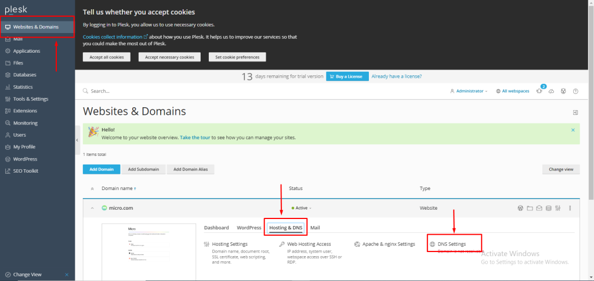

## Introduction

In this article, you will learn how to add TXT record in Plesk.

A TXT record, which is an abbreviation for "text record," is a specific kind of resource record that is used by the Domain Name System (DNS) to provide the ability to associate random text with a host or other name. This text can include information that is readable by humans about a server, network, data centre, or other accounting information. TXT records are modified as "[TXT records](https://en.wikipedia.org/wiki/TXT_record)."

Step 1. Log into your Plesk with your server password by searching server\_ip:8880 in your browser.

Step 2. Go to Hosting and DNS under the menu of websites and domains, then click on DNS settings.

Step 3. Click on "Add Record."

Step 4. In the record type drop-down menu, select TXT record.

In the domain field here, we are not using any subdomains, so for the main domain, which is micro.com, we are keeping this field empty.

In the TTL field, you can assign any value in seconds; we have entered 3600. in the TXT record field, entered the TXT record. then select OK. 

NOTE: Use your main domain instead of micro.com.

## conclusion

Hopefully, now you have learned how to add TXT record in Plesk.

Also read: [How to add MX record in Plesk](https://utho.com/docs/tutorial/how-to-add-mx-record-in-plesk/).

Thank You 🙂
