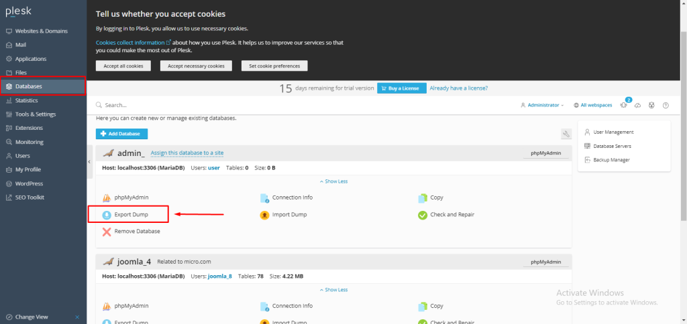
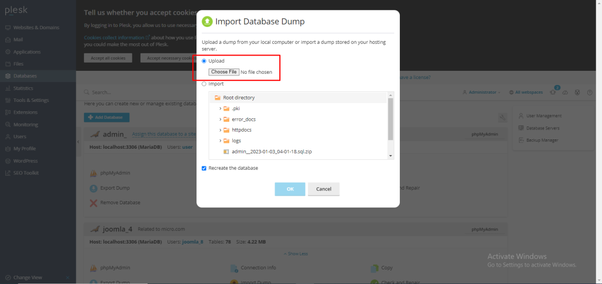
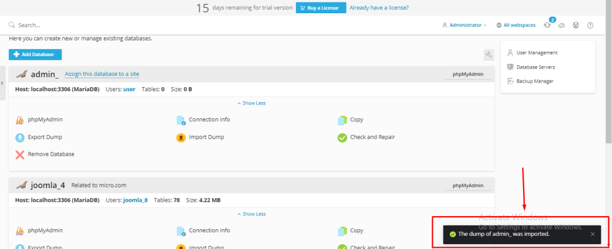

## Introduction

In this article, you will learn how to Export and Import Database Dumps in Plesk.

Step 1. Log into your [Plesk](https://en.wikipedia.org/wiki/Plesk) with your server password by searching server\_ip:8880 in your browser.

Step 2. On the left side of the screen, select "[Database](https://utho.com/docs/tutorial/how-to-create-a-mysql-mariadb-database-and-database-user-in-plesk%ef%bf%bc/)," then select "Export Dump."

Step 3. Now click on "Automatically download dump after creation" and then click on "OK."

Step 4. On the left side of the screen, select "Database," then select "Import Dump."

Step 5. Now, select Import Dump and then Choose File.

Step 6. Your dump will now be imported.

## Conclusion

Hopefully, now you have learned how to Export and Import Database Dumps in Plesk.

Thank You 🙂
