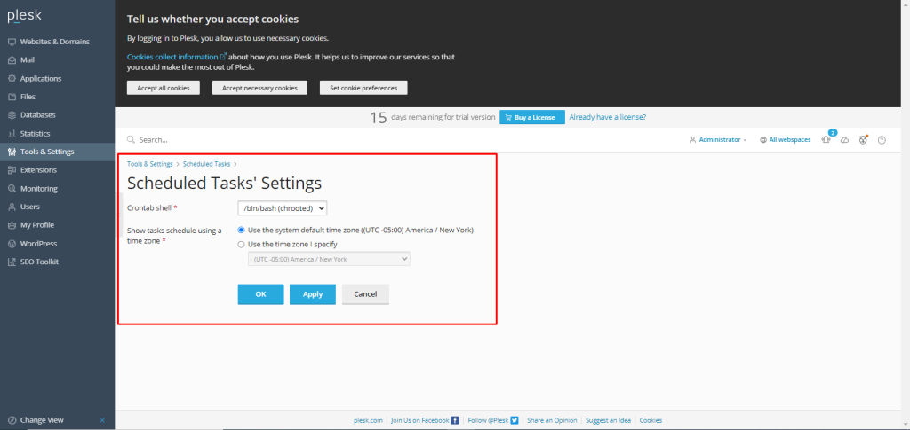
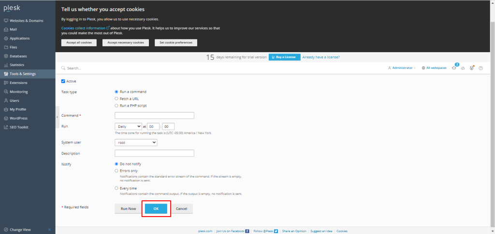

## Introduction

In this article, you will learn how to setup scheduled tasks in [Plesk](https://en.wikipedia.org/wiki/Plesk).

Step 1. Log into your Plesk with your server password by searching server\_ip:8880 in your browser.

Step 2. Select tools and settings, which are on the left side of the screen, then click on scheduled tasks.

Step 3. Click on settings.

Step 4. Select your preferred time zone and click on "Apply."

Step 5. Select tools and settings, which are on the left side of the screen, then click on scheduled tasks.

Step 6. Click on "[Add Task](https://utho.com/docs/tutorial/how-to-assign-permissions-to-files-and-folders-in-plesk/)" to add a new task.

Step 7. Fill in the details as per your own and then click on "OK."

Step 8. And then you will get a success message.

## Conclusion

Hopefully, now you have learned how to setup scheduled tasks in Plesk.

Thank You 🙂
