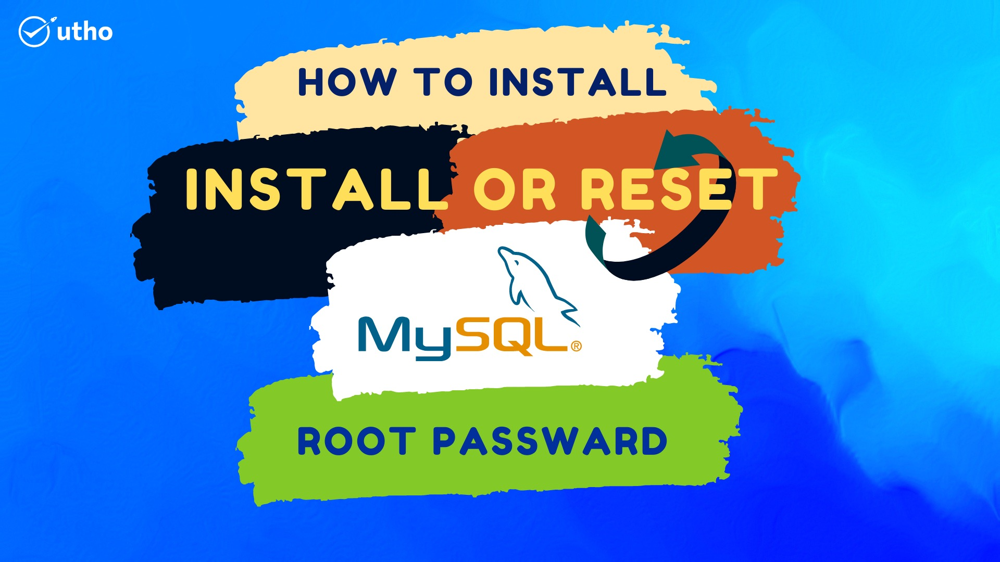

MySQL is an open-source relational database management system . Its name consists a combination of ‘My’ and ‘SQL’ as the name for the Structured Query Language of the co-founder Michael Widenius’s daughter.

Step 1: Login into the server using root credentials on putty.


Step 2. Stop the mysql service using the below command.

```
# service mysqld stop 
```

Step 3. Set the mySQL environment option by using the below command.

```
# systemctl set-environment MYSQLD_OPTS="--skip-grant-tables 
```

Step 4. Start the mysql service .

```
# systemctl start mysqld 
```

Step 5. Login to mysql using root user

```
# mysql -u root 
```

Step 6. Update the root user password with these mysql commands

```
 mysql> UPDATE mysql.user SET authentication_string = PASSWORD('MyNewPassword') -> WHERE User = 'root' AND Host = 'localhost' 
```  
```
 mysql> FLUSH PRIVILEGES; 
```

```
 mysql> quit 
```

Step 7. Stop mysqld service.

```
# systemctl stop mysqld 
```

Step 8. Unset the mysql environment option so it starts normally next time.

```
# systemctl unset-environment MYSQLD_OPTS 
```

Step 9. Start mysql normally.

```
# systemctl start mysqld 
```

Step 10. Now, login to mysql with the new password as shown in the below screenshot.


Thank you!!
