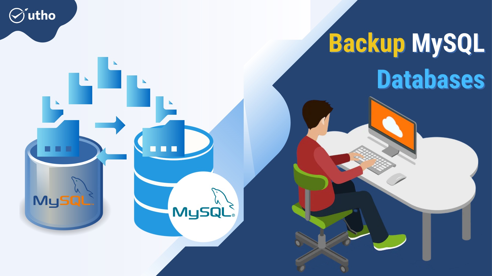

##### **Description**

The mysqldump utility is part of MySQL and MariaDB. It makes it easier to make a backup of a database or system of databases. Using mysqldump makes a logical backup and generates the SQL statements needed to recreate the original database structure and data.

**Note**  
The [database](https://en.wikipedia.org/wiki/Database) management system needs to be functioning and available because the mysqldump programme requires a connection to the database. You can instead make a physical backup, which is a copy of the file system directory holding your MySQL database, if the database is inaccessible for any reason.

Log onto the system where you'll store backups. This computer needs [MySQL](https://utho.com/docs/tutorials/how-to-install-mysql-with-phpmyadmin-on-ubuntu-14-04/) CLI (which should come with the mysqldump utility). Verify mysqldump's installation using this command:

```
#mysqldump --version
```

You'll need to know which version you're using when referring to the documentation, so this should let you know. Consult the Installing MySQL guide if mysqldump and mysql are not already installed.

**Syntax for mysqldump in general**

The following list shows numerous mysqldump commands. \[options\] contains all the backup command options you need. Common Command Options lists options.

Follow the below steps to Backup MySQL Databases using mysqldump.

## One database:

```
#mysqldump [options] [database_name] > backup.sql
```

**Tables that are unique to a single database:**

```
#mysqldump [options] [database_name] [table_name] > backup.sql
```

## Multiple particular databases:

```
#mysqldump [options] --databases [database1_name] [database2_name] > backup.sql
```

## Each database

```
#mysqldump [options] --all-databases > backup.sql
```

**Caution**  
If you wish to restore this database to a Utho MySQL Managed Database, do not use the —all-databases option. It may delete existing users and restrict database access.

**Note**  
It can take a long to finish depending on how big the database is. Use the —quick option to get rows one at a time rather than all at once if your table contains a lot of data.

## Cron-based backup automation

1.You can use the mysqldump command inside of a cron job to set up regular backups of your database.

2.Using the mysql config editor set command, you can store your database credentials and connection information. Below is an example command, but make sure to change the values to your own. See How to Safely Store Credentials for more information and options.

```
#mysql_config_editor set --login-path=[name] --user=[username] --host=[host] --password --warn
```

3.Make the folder where you want your backup files to go. This can be anywhere that your user can get to.

```
#mkdir ~/database-backups
```

4.Edit the crontab file for your user.

```
#crontab -e
```

5.Incorporate the cron job into the crontab file. Replace \[name\] with the login path name you intend to use and \[database-name\] with the database you desire to back up in the example below. As required, modify the location where the backups are stored, as well as any other options.

```
0 1 * * * /usr/bin/mysqldump --login-path**=[**name**]** --single-transaction **[**database-name**]** > ~/database-backups/backup-**$(**date +%F-%H.%M.%S**)**.sql
```

## Backup Restore

```
#mysql -u [username] -p [databaseName] < [filename].sql
```

Restore a DBMS backup's entirety. You will be requested for the password for the MySQL root user:  
This will overwrite all existing MySQL database system data.

```
#mysql -u root -p < full-backup.sql
```

one-time database dump restoration The target database for the data import must already be empty or old, and the MySQL user you're running the operation as must have write access to it:

```
#mysql -u [username] -p db1 < db1-backup.sql
```

In order to restore a single table, you need to ensure that the destination database is prepared to accept the data:

```
#mysql -u dbadmin -p db1 < db1-table1.sql
```

hope you have understood the all things to Backup MySQL Databases using mysqldump....

Must read:- [https://utho.com/docs/tutorial/how-to-install-a-php-version-in-whm/](https://utho.com/docs/tutorial/how-to-install-a-php-version-in-whm/)

##### **Thank you**
