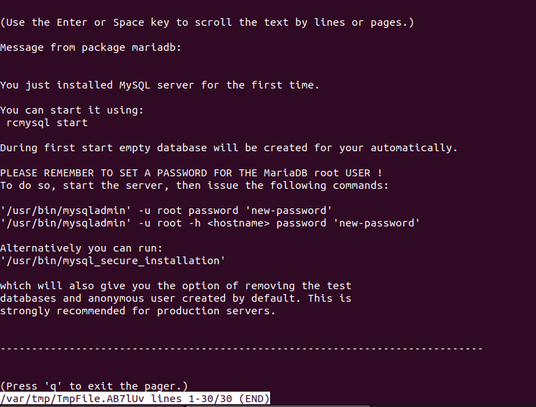
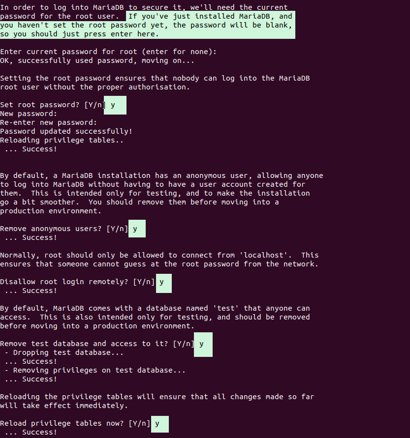

<figure>


<figcaption>

How to install Mariadb server on OpenSUSE

</figcaption>

</figure>

In this article, we will learn how to install mariadb server on OpenSUSE. MariaDB is a database management system that is a fork of MySQL. It is extremely similar to MySQL, which is a database management system. Several different applications, including data warehousing, e-commerce, enterprise-level features, and logging programmes, all make use of the MariaDB database.

[MariaDB](https://en.wikipedia.org/wiki/MariaDB) will let you to fulfil all of your burden in an effective manner; it can function in any cloud database and can function at any scale, whether it be little or huge.

A database is a repository for information that can be easily retrieved and applied in the context in which it is required. When compared to recording information on a piece of paper or in a Word document, storing all of your information in a database allows it to be organized into tables, making it simple to retrieve each individual entry in a manner that is both systematic and accurate.

## Prerequisites

- Internet enabled OpenSUSE server. If you want a server with best speed with the most affordable services and price, just visit here.

- Any normal user with SUDO privileges or Super user

## Steps to install Mariadb on your OpenSUSE server

Step 1: Refresh your zypper repolist and the install the mariadb server

```
zypper refresh && zypper install mariadb-server -y
```
<figure>


<figcaption>

Install MariaDb on your OpenSUSE server

</figcaption>

</figure>

While, installing, you will see a message to view the notification from the MariaDB package. Press **y** to view it.

<figure>


<figcaption>

View the message from Mariadb package

</figcaption>

</figure>

Step 2: Press q to exit from the message

<figure>



<figcaption>

Message from Mariadb

</figcaption>

</figure>

Step 3: Now, start and enabled the service to start using and configuring the mariadb server

```
systemctl enable --now mariadb
```
Step 4: Start Configuring the mariadb server on your opensuse server.

```
mysql_secure_installation
```
And, now read the message carefully and choose the steps accordingly. You can take the reference, of the below screenshot.

<figure>



<figcaption>

Start setup the of Mariadb server

</figcaption>

</figure>

Step 5: Test your setup by login to mariadb using below command and by using the password you have setup in the above step.

```
mysql -u root -p
```
<figure>


<figcaption>

Log in to mariadb server

</figcaption>

</figure>

Now, if you want to create a user or grant privileges to any user, [use this guide](https://utho.com/docs/tutorial/create-a-new-user-in-mysql-and-learn-how-to-grant-permissions/). And this is how you have learnt how to install Mariadb server on OpenSUSE.
