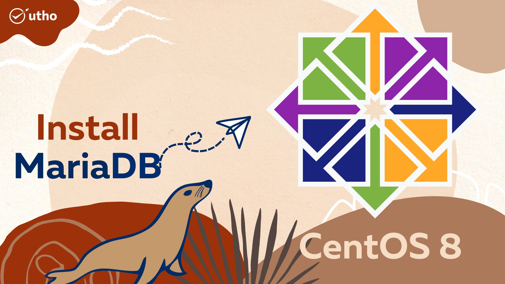

---



**Description**

A wide variety of applications, including data warehousing, e-commerce, enterprise-level functionality, and logging programmes, make use of the MariaDB database. MariaDB will let you to fulfil all of your burden in an effective manner; it can function in any cloud database and can function at any scale, whether it be little or huge. What exactly is a database, then?

## Setup and installation of MariaDB

Use the package manager to set up MariaDB.

```
#sudo yum install mariadb-server
```

Enable MariaDB to start automatically during system startup, and then start the service:

```
#sudo systemctl enable mariadb
```

```
#sudo systemctl start mariadb 
```

MariaDB defaults to 127.0.0.1. Our MySQL remote access guide also applies to MariaDB.

**Note**  
Although it is not recommended to give MariaDB unrestricted access on a public IP address, you can change the address it listens on by changing the bind-address parameter in /etc/my.cnf. Implement firewall rules that only permit connections from particular IP addresses if you choose to bind MariaDB to your public IP address.

## Securing the Installation

```
#sudo mysql_secure_installation
```

You will have the option of changing the MariaDB root password, removing anonymous user accounts, disabling root logins outside of localhost, and removing test databases. It is recommended that you select the appropriate options. More information about the script is available in the MariaDB Knowledge Base.

**Root Login**

```
#sudo mysql -u root -p
```

When prompted, enter the root password that you established prior to running the mysql secure installation script.

After that, the MariaDB prompt and a welcome header will be displayed to you, as shown in the following example:

```
MariaDB [(none)]>
```

**Make a New Database and User in MariaDB**

Relog into the database if necessary. Enter a password if you set one above.

```
#sudo mysql -u root -p
```

Testdb is the database, testuser is the user, and password is the user's password. You need a strong password.

```
#CREATE DATABASE testdb;
```

```
#CREATE user 'testuser'@localhost IDENTIFIED BY 'password';
```

```
#GRANT ALL ON testdb.* TO 'testuser' IDENTIFIED BY 'password';
```

This procedure can be sped up by creating the user and assigning database permissions at the same time:

```
#CREATE DATABASE testdb;
```

```
#GRANT ALL ON testdb.* TO 'testuser' IDENTIFIED BY 'password';
```

Then exit MariaDB as follows:

```
#exit;
```

## Reset the MariaDB Root Password

Put a stop to the running instance of MariaDB server.

```
#sudo systemctl stop mariadb
```

Then run the following command to allow the database to start without loading the grant tables or connecting to the network.

```
#sudo systemctl set-environment MYSQLD_OPTS="--skip-grant-tables --skip-networking"
```

Restart MariaDB:

```
#sudo systemctl start mariadb
```

This time, login to the MariaDB server with the root account without providing a password:

```
#sudo mysql -u root
```

Follow these steps to change root's password. Change the password to a strong one:

```
#FLUSH PRIVILEGES;
```

```
#UPDATE mysql.user SET password = PASSWORD('password') WHERE user = 'root';
```

Make necessary adjustments to the authentication procedures for the root password:

```
#UPDATE mysql.user SET authentication_string = '' WHERE user = 'root';
```

```
#UPDATE mysql.user SET plugin = '' WHERE user = 'root';
```

```
#exit;
```

Restore the database's environment settings to allow it to start with grant tables and networking:

```
#sudo systemctl unset-environment MYSQLD_OPTS
```

Then restart MariaDB:

```
#sudo systemctl start mariadb
```

Using your new root password, you should be able to access the database:

```
#sudo mysql -u root -p
```

**Thank you**
