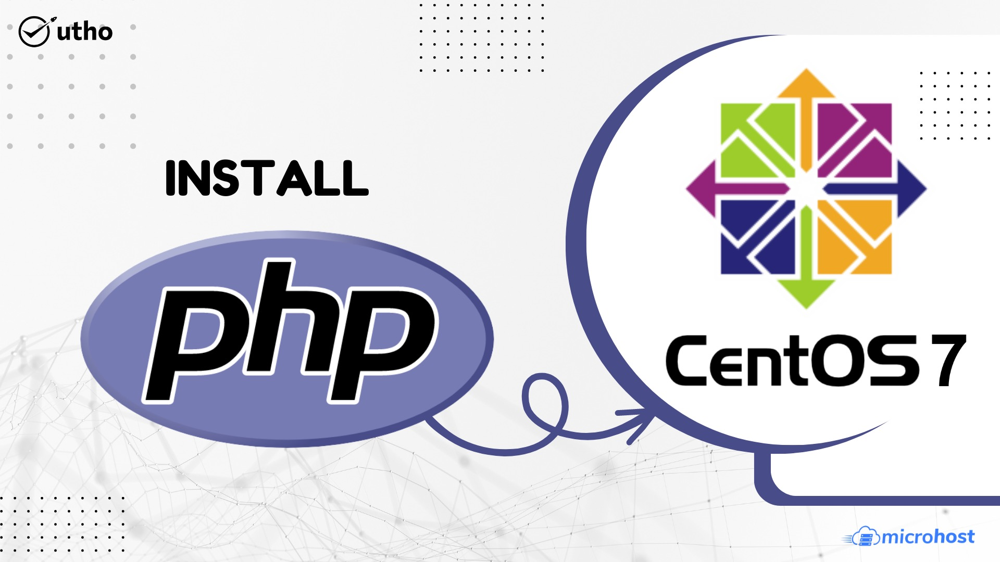

## Introduction

In this article you will learn how to install PHP 7.4 n Centos 7.

[PHP](https://en.wikipedia.org/wiki/PHP) is the most widely used server-side scripting language in creation of dynamic web pages. PHP applications usually work well with HTML and interact with relation database management systems, here are the steps to Install PHP 7.4 on CentOS.

PHP is an open-source server-side programming language that may be used to construct a wide range of various things, such as websites, applications, and customer relationship management systems. PHP is a server-side programming language. It is a programming language that may be used for a variety of purposes and is rather popular. Additionally, it can be included into HTML. Because PHP can work with HTML, it has remained one of the most widely used programming languages in the development community. This is due to the fact that PHP contributes to the simplification of the HTML code.

The phrase "PHP: Hypertext Preprocessor" is what the acronym PHP refers to, with the "PHP" in PHP initially standing for "Personal Home Page" inside this abbreviation. Since its creation in 1994, the phrase has gone through a number of modifications in order to provide a more accurate description of the nature of the entity to which it refers.

For nearly three decades, PHP has been a go-to language for web development thanks to its many features and flexibility.

## **Step 1 — Add REMI Repository**

```
# sudo yum -y install https://rpms.remirepo.net/enterprise/remi-release-7.rpm
```

## **Step 2 —** **Install PHP 7.4 on CentOS 7**

We can now enable PHP 7.4 Remi repository and install PHP 7.4 on [CentOS 7](https://utho.com/docs/tutorial/how-to-add-a-user-and-grant-root-privileges-on-centos-7/).

```
# sudo yum-config-manager --enable remi-php74
```

```
# sudo yum install php php-cli -y
```

## **Step 3** **—** Use the next command to install additional packages:

```
# sudo yum install php php-cli php-fpm php-mysqlnd php-zip php-devel php-gd php-mcrypt php-mbstring php-curl php-xml php-pear php-bcmath php-json -y
```

## **Step 4 —** Check the PHP version with the below command.

```
# php -v
```


According to the needs of your programme, you may also need to include extra PHP modules. More helpful PHP modules will be installed using the following command.

```
# yum --enablerepo=remi-php74 install php-xml php-soap php-xmlrpc php-mbstring php-json php-gd php-mcrypt
```

The following command can be used to check for additional PHP modules in the set up yum repositories. To find all of PHP 7.4's modules, try the command below as an example.

```
# yum --enablerepo=remi-php73 search php | grep php73
```

## conclusion

I hope you have learned how to install PHP 7.4 on Centos 7.

Thank You 🙂
