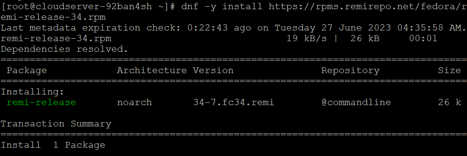
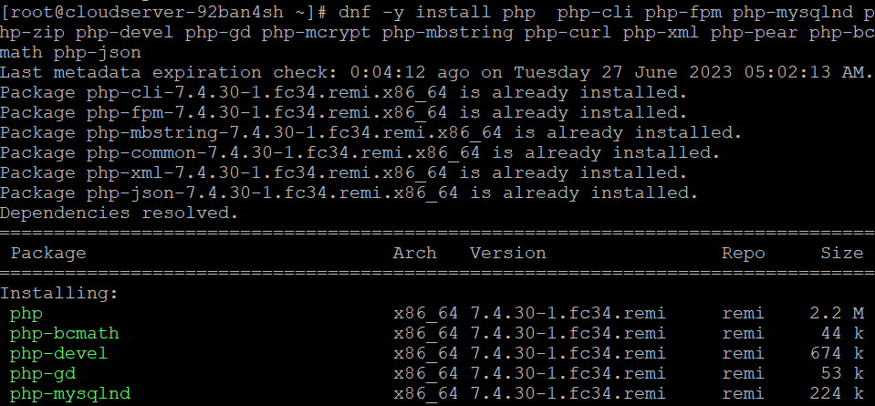

## Introduction

In this article, you will learn how to install PHP 7.4 on Fedora 34.  

[PHP](https://en.wikipedia.org/wiki/PHP)(a made up word for PHP: Hypertext Preprocessor) is an embedded scripting language in HTML that is widely used due to its flexibility and ease of use in web development.

PHP is an open-source server-side programming language that may be used to construct a wide range of various things, such as websites, applications, and customer relationship management systems. PHP is a server-side programming language.

It is a programming language that may be used for a variety of purposes and is rather popular. Additionally, it can be included into HTML. Because PHP can work with HTML, it has remained one of the most widely used programming languages in the development community. This is due to the fact that PHP contributes to the simplification of the HTML code[.](https://en.wikipedia.org/wiki/PHP)

#### Step 1: Update Fedora system

**Get the most recent updates for the packages that are currently installed.**

```
# dnf update -y

```

#### Step 2: Add REMI Repository

**To add the REMI repository to your Fedora system, run the commands that are given below.**

```
# dnf install [https://dl.fedoraproject.org/pub/epel/epel-release-latest-8.noarch.rpm](https://dl.fedoraproject.org/pub/epel/epel-release-latest-8.noarch.rpm) --skip-broken

```

```
# dnf -y install https://rpms.remirepo.net/fedora/remi-release-34.rpm

```



#### Step 3: Install PHP 7.4 on Fedora

**Some dependencies necessary are accessible in remi repository. Enable the remi repository, as well as the remi-php74 repository.**

**It is necessary to enable the following frequently used dependencies, which may be found in the remi repository:**

```
# dnf config-manager --set-enabled remi

```

```
# dnf module reset php -y

```

**Install PHP 7.4 on Fedora 34 by using below command:**

```
# dnf module install php:remi-7.4 -y

```


**Verify the currently installed version of PHP by using the following command.**

```
# php -v

```


**Simply execute the following command in order to install extra PHP packages or extensions.**

```
# dnf -y install php php-cli php-fpm php-mysqlnd php-zip php-devel php-gd php-mcrypt php-mbstring php-curl php-xml php-pear php-bcmath php-json

```



**Execute the following command in order to view the modules that are enabled.**

```
# php --modules

```


## Conclusion

Hopefully, now you have learned how to install PHP 7.4 on Fedora 34.

**Also Read:** [How to Use Iperf to Test Network Performance](https://utho.com/docs/tutorial/how-to-use-iperf-to-test-network-performance/)

Thank You 🙂
