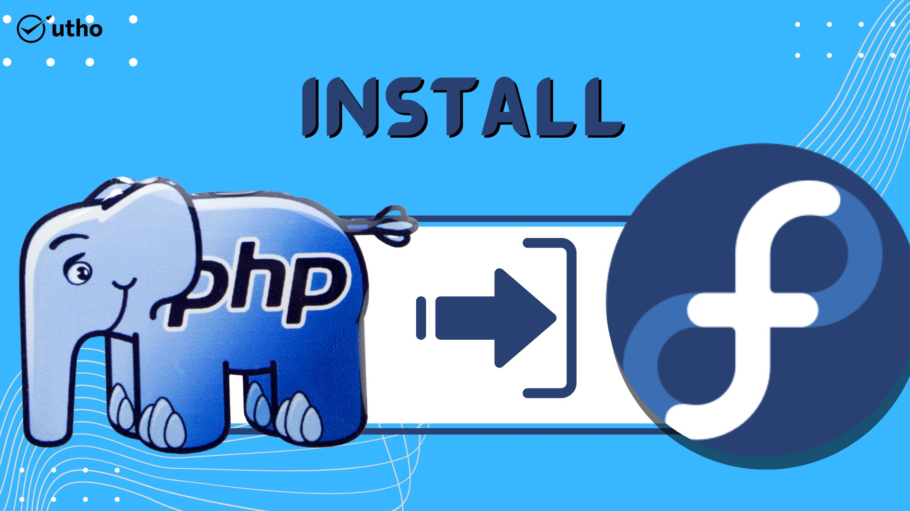

In this article, you will learn how to install PHP 7.4 on Fedora 36/35/34/33/32/31.  

[PHP](https://en.wikipedia.org/wiki/PHP) (a made up word for PHP: Hypertext Preprocessor) is an embedded scripting language in HTML that is widely used due to its flexibility and ease of use in web development.

PHP is an open-source server-side programming language that may be used to construct a wide range of various things, such as websites, applications, and customer relationship management systems. PHP is a server-side programming language. It is a programming language that may be used for a variety of purposes and is rather popular. Additionally, it can be included into HTML. Because PHP can work with HTML, it has remained one of the most widely used programming languages in the development community. This is due to the fact that PHP contributes to the simplification of the HTML code.

PHP 7.4 comes with a remarkable amount of new features. Its RPM packages are available in the **remi-php74** repository for **Fedora** ≥ **29**. Follow the few steps below to install PHP 7.4 on Fedora 36/35/34/33/32.

## Step 1: Update Fedora system

Get the most recent updates for the packages that are currently installed.

```
# sudo dnf -y update
```

## Step 2: Add REMI Repository

To add the REMI repository to your Fedora system, do the commands that are given below.

_Fedora 31_\=```
# sudo dnf -y install https://rpms.remirepo.net/fedora/remi-release-31.rpm
```

_Fedora 32_\=```
# sudo dnf -y install https://rpms.remirepo.net/fedora/remi-release-32.rpm
```

_Fedora 33_\=```
# sudo dnf -y install https://rpms.remirepo.net/fedora/remi-release-33.rpm
```

_Fedora 34_\=```
# sudo dnf -y install https://rpms.remirepo.net/fedora/remi-release-34.rpm
```

_Fedora 35_\=```
# sudo dnf -y install https://rpms.remirepo.net/fedora/remi-release-35.rpm
```

_Fedora 36_\=```
# sudo dnf -y install https://rpms.remirepo.net/fedora/remi-release-36.rpm
```

## Step 3: Install PHP 7.4 on Fedora

Some dependencies necessary are accessible in remi repository. Enable the remi repository, as well as the remi-php74 repository.

It is necessary to enable the following frequently used dependencies, which may be found in the remi repository:

```
# sudo dnf config-manager --set-enabled remi
```

```
# sudo dnf module reset php -y
```

Install PHP 7.4 on Fedora 36/35/34/33/32/31 by using these command:

```
# sudo dnf module install php:remi-7.4 -y
```

Verify the currently installed version of PHP by using the following command.

```
# php -v
```


Click to know [How To Install PHP 7.4 on Debian 10](https://utho.com/docs/tutorial/how-to-install-php-7-4-on-debian-10/)

Thank You 🙂
