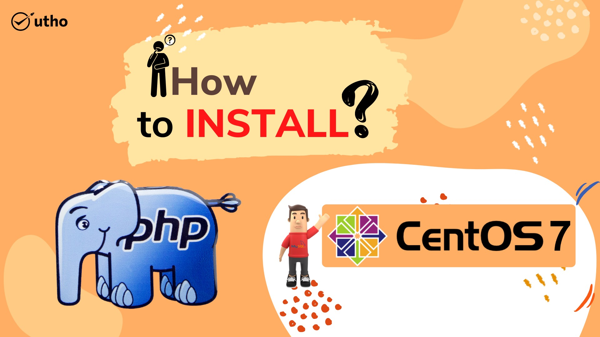

PHP is the part of our setup that processes code for dynamic content display. It can run scripts, link to our MySQL databases, and view processed content to our web server.

Step 1. We can use the following command for the installation of our components. The php-mysql kit will also be included.

```
 # yum install php php-mysql 
```

Step 2. PHP should be built problem-free. To function with PHP we have to restart the Apache web server.

```
 # systemctl restart httpd 
```

Step 3. We can install the php modules by the following command.

```
 # yum install php-fpm 
```

Step 4. We can test the php using the test page. We will edit create a php file at given location.

```
 # vi /var/www/html/info.php 
```

Now copy the content as given below in the file and save the file by :wq

\[filecode file="/var/www/html/index.php" \[/filecode\]

Step 5 : We can access the page by following url.

[http://your\_server\_ip/info.php](http://your_server_ip/info.php)


Thank you!
