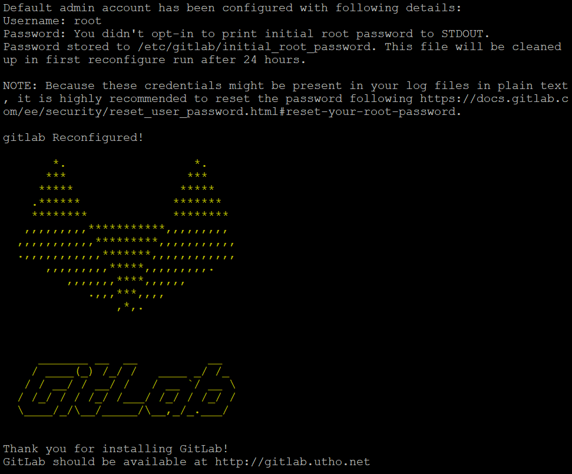
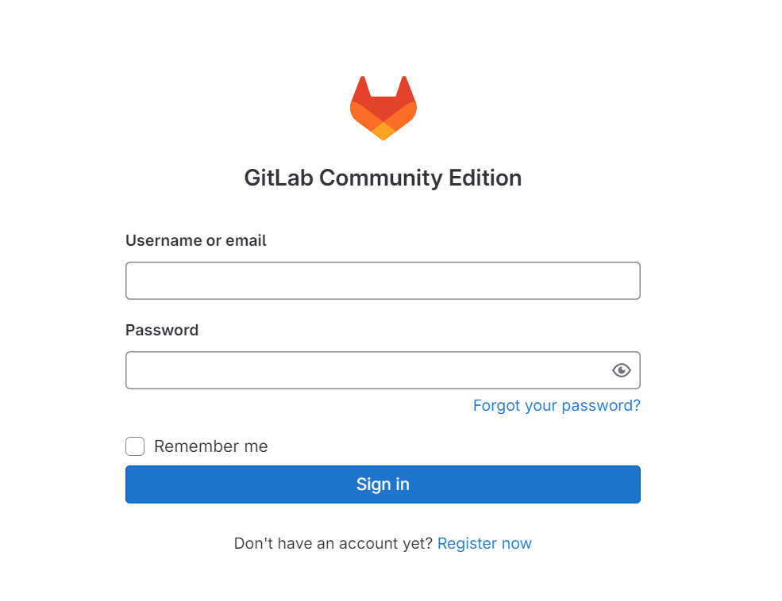

## Introduction

In this article, you will learn how to install GitLab on AlmaLinux 8.

[GitLab](https://en.wikipedia.org/wiki/GitLab) is an open-source tool that makes it easy to manage repositories, issues, CI/CD pipelines, and much more. If you use AlmaLinux 8 and want to set up your own GitLab instance to streamline your DevOps process, you're in the right place.

This step-by-step tutorial will show you how to install GitLab on AlmaLinux 8. There are two versions of GitLab: Enterprise Edition (EE) and Community Edition (CE). We'll talk about the community version in this post.

##### Step 1: Update the System

**Let's start by updating the list of packages and upgrading any packages that are already installed to their most recent versions.**

```
# dnf update -y

```

```
# dnf upgrade -y

```

##### Step 2: Install Dependencies

**GitLab needs some other things to work properly. Use the following instructions to set them up:**

```
# dnf install -y curl openssh-server ca-certificates postfix

```


##### Step 3: Add GitLab Apt Repository

**Run the following curl command to add the GitLab project. It will instantly figure out what version of AlmaLinux you have and set the repository to match.**

```
# curl https://packages.gitlab.com/install/repositories/gitlab/gitlab-ce/script.rpm.sh | bash

```


##### Step 4: Install Gitlab

**Run the command below to quickly install and set up gitlab-ce on your AlmaLinux system. Replace the server's hostname with the name of your setup.**

```
# EXTERNAL\_URL="http://gitlab.utho.net" dnf install gitlab-ce

```

**Once the command above has been run properly, the output will look something like this:**



**The output shown above shows that GitLab has been set up correctly. The user name for the gitlab web interface is "root," and the password is saved at "/etc/gitlab/initial\_root\_password."**

##### Step 5: Access GitLab Web Interface

**Once GitLab is loaded and set up, open your web browser and type in the IP address or hostname of your server.**



## Conclusion

Hopefully, now you have learned how to install GitLab on AlmaLinux 8.

**Also Read:** [How to Use Iperf to Test Network Performance](https://utho.com/docs/tutorial/how-to-use-iperf-to-test-network-performance/)

Thank You 🙂
