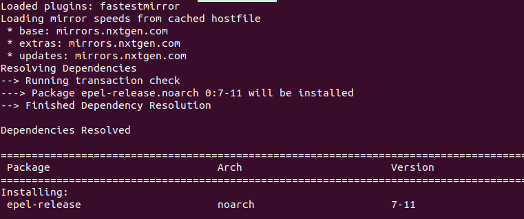

<figure>


<figcaption>

How to install snap on AlmaLinux

</figcaption>

</figure>

[Snaps are programmes](https://en.wikipedia.org/wiki/Snap_(software)) that have all of their dependencies bundled and ready to run on all widely used Linux distributions from a single build. They automatically update and gracefully roll back.

The Snap Store, an app store with millions of users, allows users to find and download Snaps.

Snaps are safe because they are contained and sandboxed to prevent system compromise. They operate at various confinement levels, which refer to how isolated they are from one another and the base system. More significantly, each snap has a carefully chosen interface that the designer carefully considered depending on the requirements of the snap in order to enable access to particular system resources outside of its confinement, such as network access, desktop access, and more.

## Prerequesites

- Any normal user with SUDO privileges or Super user

- dnf repositories configured with [CentOS server.](https://utho.com/docs/tutorial/microhost-product-details/)

## Steps to install Snap on CentOS server

Step 1: Before installing the Snap on your server, you need to install the extra packages for enterprises linux( EPEL) repsitories

```
dnf install epel-release
```
<figure>



<figcaption>

Installing EPEL repo

</figcaption>

</figure>

Step 2: Install the Snap by executing the below command

```
dnf install snapd
```
<figure>


<figcaption>

Install the Snap on Centos

</figcaption>

</figure>

Step 3: Start and enable the snapd socket to start working with snapd

```
systemctl enable --now snapd.socket
```
```
Output-
Created symlink from /etc/systemd/system/sockets.target.wants/snapd.socket to /usr/lib/systemd/system/snapd.socket.

Step 4: Now, you must enter the following to establish a symbolic link between /var/lib/snapd/snap and /snap in order to enable support for traditional snaps:
```

```
ln -s /var/lib/snapd/snap /snap
```
Step 5: Now, either set the PATH varialbe using the below command or restart another terminal

```
echo export PATH=$PATH:/snap/bin >> ~/.bashrc
```
```
export .bashrc
```
Step 6: Check the snapd version.

```
snap version
```

<figure>


<figcaption>

Version of Snap

</figcaption>

</figure>

And this is how you will install the Snap on AlmaLinux server
