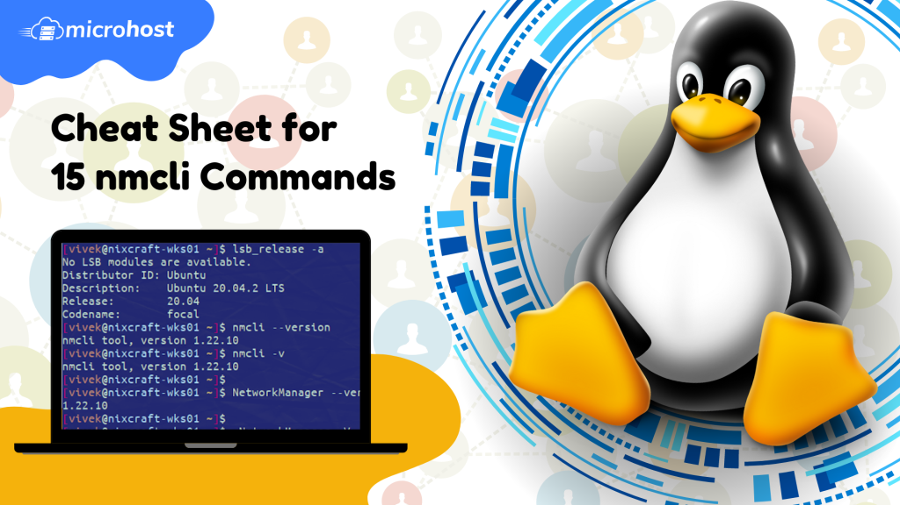

**Description**

I will walk you through 15 different examples of using the [nmcli tool](https://www.geeksforgeeks.org/nmcli-command-in-linux-with-examples/) in Linux. nmcli is a command-line programme that is open-source and may be used to control NetworkManager and report on the state of networks. It is utilised to a large extent by Linux specialists so that they can harness the power of Network Manager directly from the command line. Creating, displaying, editing, deleting, activating, and deactivating network connections, as well as controlling and displaying the status of network devices, are all possible tasks that may be accomplished with the help of nmcli.

## UUID: what is it?

A UUID, or universally unique identifier, is a 128-bit integer used to identify an object or entity on the Internet.

## 1.How to find the version of nmcli

You will need to run the nmcli —version command in order to determine the version of nmcli that is currently installed on your system.

```
nmcli --version
```
## 2,How to Double-Check Each and Every Connection to a Network Device

The nmcli connection command is what you need to use to see all the network device connections that are available. If the nmcli connection command doesn't have any parameters, it will show both system and user setting connections that have been set up.

```
nmcli connection
```
## 3.Checking the Status of All Network Devices

Use the nmcli device status command to verify the status of all network devices. This command displays both controlled and unmanaged devices.

```
nmcli device status
```
## 4.How to Display the Status of a Radio Switch 

If you wish to see the current status of the radio switches, use the nmcli radio all command.

```
nmcli radio all
```
## 5.How to Display All Network Devices

```
nmcli device show
```
## 6.How to Check the Status of NetworkManager 

Use the nmcli -t -f RUNNING general command to check the running status of NetworkManager in concise output mode.

```
nmcli -t -f RUNNING general
```
## 7.Network Manager Status Check

nmcli -t -f is what you need to use to check the status of Network Manager as a whole in terse output mode. STATE general command

```
nmcli -t -f STATE general
```
## 8.Checking Terse Output

use the nmcli -t device command to show a list of all the network devices that are currently set up in a concise way.

```
nmcli -t device
```
## 9.Check how Network Manager logs.

Then you need to use the nmcli general logging command to check the current Network Manager logging settings.

```
nmcli general logging
```
## 10.Create a new connection profile.

If you want to create an Ethernet type connection profile using interface enp1s0, then you need to use the nmcli c add type ethernet connection command. command interface-name enp1s0.

```
mcli c add type ethernet connection.interface-name enp1s0
```
## 11.Examine the NetworkManager Polkit Permissions 

Use the nmcli general permissions command to check the Polkit permissions set up for different NetworkManager operations. A system administrator sets up these permissions or actions (in Polkit language), and users can't change them.

```
nmcli general permissions
```
## 12.Using the nmcli command, change the hostname. 

You can also change the system's hostname with nmcli. You can use the nmcli general hostname command to find out what the current hostname is.

```
nmcli general hostname
```
## 13.create a bridge using the nmcli command

Use the nmcli con add type bridge ifname bridge name> command to make a bridge. In this example, we use the nmcli con add type bridge ifname br0 command to create a bridge called br0.

```
nmcli con add type bridge ifname br0
```
## 14.nmcli command to disable bridge STP

By default, the Spanning Tree Protocol (STP) will be turned on. To turn it off, use the nmcli con mod bridge-br0 bridge.stp no command.

```
nmcli con modify bridge-br0 bridge.stp no
```
If you want to turn on STP again, use the command nmcli con mod bridge-br0 bridge.stp yes.

```
nmcli con modify bridge-br0 bridge.stp yes
```
## 15.Convert an Interface to an unmanaged Interface

Use the nmcli device status command to look at the list of interfaces and then the state of an interface.

```
nmcli device status
```
**Conclusion**

nmcli is a command-line software that is open-source that may be used to report on the state of networks as well as control NetworkManager. Linux experts make extensive use of it so that they may access the power of Network Manager straight from the command line. This enables them to do their jobs more efficiently. With the assistance of nmcli, one is able to accomplish a wide variety of tasks, including creating, displaying, editing, deleting, activating, and deactivating network connections, as well as controlling and displaying the status of network devices. In addition, one is able to edit and delete network connection information.

Must Read : [How To Add a User and Grant Root Privileges on Ubuntu 18.04](https://utho.com/docs/tutorial/how-to-add-a-user-and-grant-root-privileges-on-ubuntu-18-04/)

**Thankyou**
