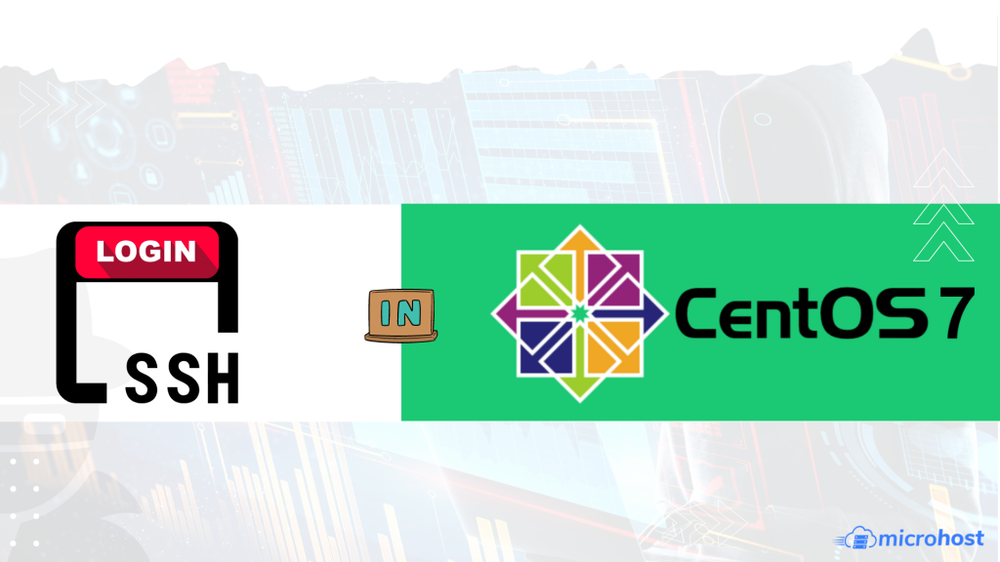

Today, everyone knows that Linux systems comes with root user access and by default the root access is enabled for outside world. For security reason it’s not a good idea to have ssh root access enabled for unauthorized users. Because any hacker can try to brute force your password and gain access to your system.

So, its better to have another account that you regularly use and then switch to root user by using ‘su –‘ command when necessary. Before we start, make sure you have a regular user account and with that you su or sudo to gain root access.  

In Linux, it’s very easy to create separate account, login as root user and simply run the ‘adduser‘ command to create separate user. Once user is created, just follow the below steps to disable root login via SSH.

To disable root login, open the main ssh configuration file /etc/ssh/sshd\_config with your choice of editor.  

```
 # vi etc/ssh/sshd_config 
```

Search for the following line in the file.  

```
 #PermitRootLogin no 
```

Now need to untag this line (remove #) then save the file and exit.

PemitRootLogin no

Next, we need to restart the SSH daemon service.

```
 # systemctl restart ssh.service 
```

:: Now need to check the server with new ssh connection, that actually root access is working or not


Thank You.
