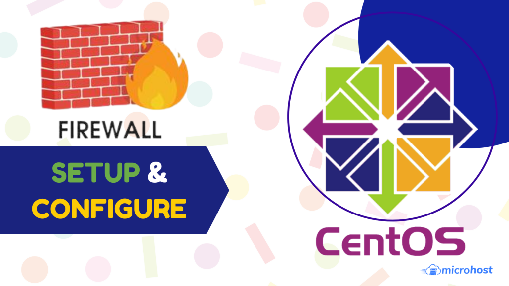

Firewall is a software program that implements a set of rules that allows or rejects data packets in a network. Firewalld is a dynamic firewall management tool. In this article , you will learn to setup and manage firewall on your server.

## Install and enable Firewall

```
yum install firewalld
```

```
systemctl enable firewalld
```

```
sudo reboot
```

To know the status of firewall by this command

```
sudo firewall-cmd --state
``` OR

```
systemctl status firewalld
```

If output is showing “running” this indicates that our firewall is up and running with the default configuration.

To reload a Firewall configuration:

```
sudo firewall-cmd --reload
```

## Disable and stop firewall

```
 systemctl stop firewalld 
```

```
 systemctl disable firewalld 
```

## Firewall zone

Zones are set of rules that allow a specific traffic and network services based on various trust of levels. Each zone allows different type of services and ports.  When we enable FirewallD first time then “public” will be default zone.

**Drop Zone -** This is the lowest level of trust. Only outgoing connections are allowed in this zone. All incoming connection are dropped without any reply.  

**Block zone -** Block zone is similar to drop zone. The only difference is, if we use this incoming request is rejected with **icmp-host-prohibited** message.  

**Public zone -** Selected connections are accepted by defining rules in this zone other connections will be dropped.   

**External zone -** This zone is for external networks with masquerading is enabled other connections will be rejected only specified connection will be allowed.  

**DMZ zone -** Demilitarized zone provides limited access to your internal network. Only specified connections will be allowed.  

**Work Zone -** This zone is used for work areas. Most of the computers are trusted in the network. Only specified connections will be allowed.  

**Home zone -** This zone is used for home areas. Few more connections are allowed.  

**Internal zone -** This zone is used for internal networks with selected connections allowed.

**Trusted zone -** Trust all the network connections. If we set this zone then all traffic will be accepted.

To know about the default zone

```
firewall-cmd --get-default-zone
```

To know which zone is active currently by typing this command-

```
firewall-cmd --get-active-zone
```

To change the default zone

```
sudo firewall-cmd --set-default-zone=internal
```

To list all active services, ports, rules using this command-

```
 sudo firewall-cmd --list-all 
```

## Firewalld configuration

Firewalld Services is configured with XML files and located at `/usr/lib/firewalld/services/` and `/etc/firewalld/services/` directories.

Firewalld have two configuration sets-

1. Runtime
2. Permanent

**Runtime -** If we use runtime configuration the changes will not retained after restarting firewalld or reboot the server.

Add the permanent rule to both http and https service.

```
 sudo firewall-cmd --zone=public --add-service=http
```

```
 sudo firewall-cmd --zone=public --add-service=https 
```

**Permanent -** Permanent configuration changes will be retained after reboot.

```
sudo firewall-cmd --zone=public --add-service=http
``````
 sudo firewall-cmd --zone=public --add-service=https 
```

By default, firewall-cmd command apply the runtime configuration but when we use --permanent flag it will create permanent configuration. For adding a permanent rule, we can use this method.

```
sudo firewall-cmd --zone=public --add-service=http --permanent
```

```
sudo firewall-cmd --zone=public --add-service=http
```

To add service SMTP(port 25) and SMTPS(port 465)

```
firewall-cmd --zone=public --add-service=smtp --permanent
```

```
firewall-cmd --zone=public --add-service=smtps --permanent
```

## Firewall Rules

### Opening and removing a Port for your Zones

To open a specific port to run any application

```
sudo firewall-cmd --permanent --zone=public --add-port=80/tcp
```

Output - success

```
sudo firewall-cmd --permanent --zone=public --add-port=21/tcp
```

Output - success

We can open a range of ports by using this command.

```
sudo firewall-cmd --permanent --add-port=200-300/tcp
```

You can check all open ports by using this command -

```
sudo firewall-cmd --zone=public --list-ports
```

To remove an added port use -remove by this command-

```
firewall-cmd --zone=public --remove-port=5000/tcp
```

Adding and removing ports using firewalld -

```
firewall-cmd --zone=public --add-service=ftp 
```

```
firewall-cmd --zone=public --remove-service=ftp
```

```
firewall-cmd --zone=public --list-services
```

## Advanced Configuration

Services and ports are fine for simple configuration but for advanced scenarios can be too restricted. Rich rules and Direct Interface allow you to add custom firewall rules for any port, protocol, address and action in any region.

### Rich Rules

Rich rules syntax is comprehensive but completely documented on the firewalld.richlanguage(5) man page (or in your terminal see man firewalld.richlanguage). To control them, use —add-rich-rule, —list-rich-rules and —remove-rich-rule with the command firewall-cmd.

Allow all IPv4 traffic from host 192.0.2.0

```
sudo firewall-cmd --zone=public --add-rich-rule 'rule family="ipv4" source address=192.0.2.0 accept'
```

Deny IPv4 traffic over TCP from host 192.0.2.0 to port 22

```
sudo firewall-cmd --zone=public --add-rich-rule 'rule family="ipv4" source address="192.0.2.0" port port=22 protocol=tcp reject'
```

To list your current Rich Rules in the public zone:

```
sudo firewall-cmd --zone=public --list-rich-rules
```

Thankyou
