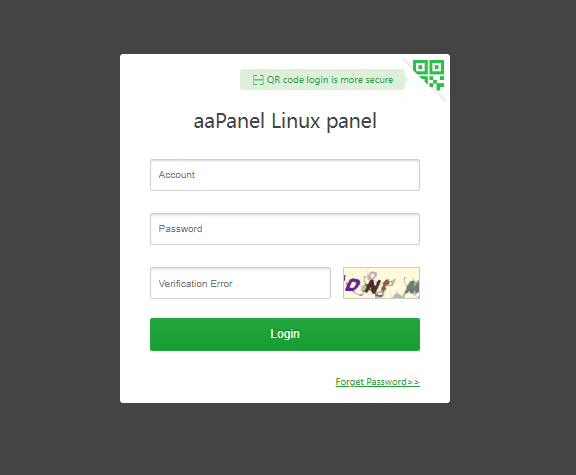

## Introduction

In this article, you will learn how to install aaPanel on Centos 7 by one click.

aaPanel is a control panel for web servers that is an [alternative](https://utho.com/docs/tutorial/how-to-migrate-accounts-from-cwp-to-cwp/) to cPanel and Vesta. It was developed in China. BT.cn is responsible for its development, and it is now on version v6. 8.5 (at the moment of the writing). It is free, has reached an adequate level of maturity, and comes with some really excellent features such as an editor, uploader, file management, backups, and preconfigured Nginx rules.

Note: If you are setting up a new system that has not yet had other environments such as Apache/Nginx/php/MySQL installed, you will need to install [aaPanel](https://www.aapanel.com/new/index.html).

The following components are often included in web hosting control panels:

- [Web server](https://en.wikipedia.org/wiki/Web_server) (e.g. [Apache HTTP Server](https://en.wikipedia.org/wiki/Apache_HTTP_Server), [NGINX](https://en.wikipedia.org/wiki/Nginx), [Internet Information Services](https://en.wikipedia.org/wiki/Internet_Information_Services))
- [Domain Name System](https://en.wikipedia.org/wiki/Domain_Name_System) server
- [Mail server](https://en.wikipedia.org/wiki/Mail_server) and [spam](https://en.wikipedia.org/wiki/Messaging_spam) filter
- [File Transfer Protocol](https://en.wikipedia.org/wiki/File_Transfer_Protocol) server
- [Database](https://en.wikipedia.org/wiki/Database)
- [File manager](https://en.wikipedia.org/wiki/File_manager)
- [System monitor](https://en.wikipedia.org/wiki/System_monitor)
- [Web log analysis software](https://en.wikipedia.org/wiki/Web_log_analysis_software)
- [Firewall](https://en.wikipedia.org/wiki/Firewall_(computing))
- [phpMyAdmin](https://en.wikipedia.org/wiki/PhpMyAdmin)

## Installation

```
# yum install -y wget && wget -O install.sh http://www.aapanel.com/script/install_6.0_en.sh && sh install.sh 93684c35
```


Paste the aapanel Internet address in your browser to login into the aapanel, which is shown in the previous screenshot. Username and password are also shown in the screenshot.



## Conclusion

Hopefully, you have learned how to install aaPanel on Centos 7 by one click.

Thank You 🙂
