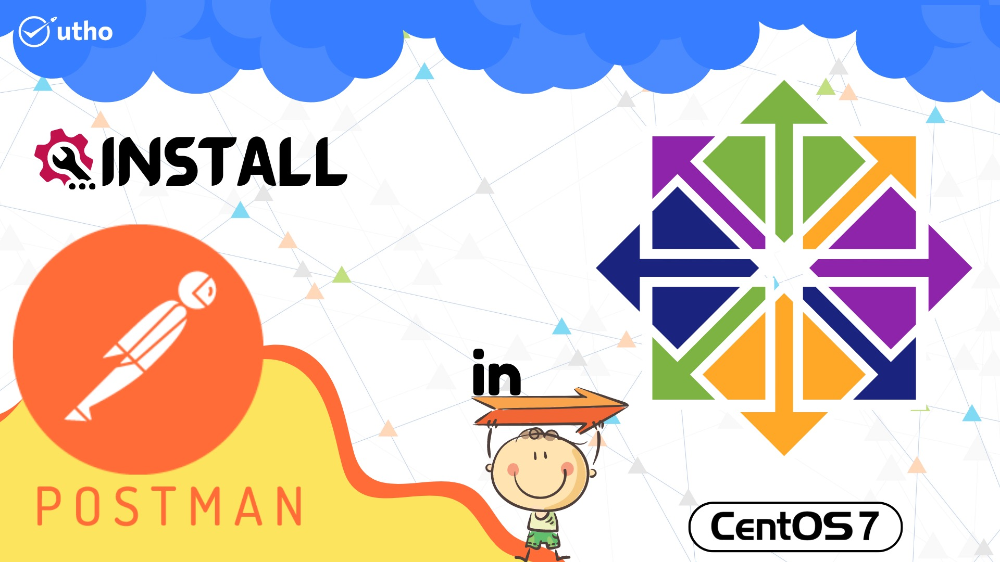

## Introduction

In this article, you will learn how to install Postman on [Centos 7](https://utho.com/docs/tutorial/how-to-install-git-on-centos-7/).

To put it more plainly, [Postman](https://en.wikipedia.org/wiki/Postman_(software)) is a computer application that is utilised for API testing. Postman communicates with the web server in order to make an API request and then receives the response, irrespective of what it may be. When sending and receiving requests using Postman, there is no need for any further effort or the setting up of a framework. Utilized to a large extent by both testers and developers for the purpose of improving application testing. It is simple to integrate with both your Continuous Integration (CI) Pipeline and your Continuous Development Pipeline.

Postman has been utilised by millions of testers due to its extensive feature set as well as its user-friendliness. You may submit requests quickly and easily with its straightforward and uncomplicated graphical user interface; all you need to do is fill in the relevant data, choose the HTTP method, and click the "Send" button. Automation, which enables users to set up tests and write test suites, is another feature that sees widespread usage.

Postman provides a paid version in addition to its free version, which allows for multiple user access, control over roles and access, SSO Authentication, and a number of other professional features. Postman is an ideal testing tool because it enables users to set up the required environment, write specifications, and finally monitor every step. This is the only feature that makes Postman ideal.

## Install Postman

```
# yum upgrade
```

```
# yum install snapd -y
```

```
# snap install postman
```

## Postman CLI

Postman is the company that creates, maintains, and signs the Postman CLI (Command Line Interface), which is the command-line companion. You will also be able to run collections, lint API schemas, perform security and governance checks, as well as log in and out of the system. The app will receive a notification of each and every test result automatically.

```
# curl -o- "https://dl-cli.pstmn.io/install/linux64.sh" | sh
```


To learn more about Postman, run the following command. 

```
# postman
```


## Conclusion

Hopefully, you have learned how to install Postman on Centos 7.

Thank You 🙂
