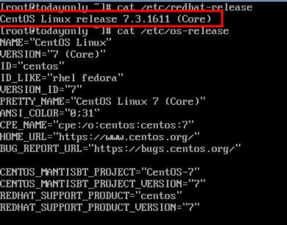

<figure>


<figcaption>

How to Update or Upgrade CentOS 7.1, 7.2, 7.3, 7.4, 7.5, or 7.6 to CentOS 7.7

</figcaption>

</figure>

**Description**

Article for How to Update or Upgrade CentOS 7.1, 7.2, 7.3, 7.4, 7.5, or 7.6 to CentOS 7.7

[CentOS](https://en.wikipedia.org/wiki/CentOS) is a Linux distribution that offers users a free and community-supported computing platform that is functionally compatible with Red Hat Enterprise Linux, the distribution that servers as its upstream source.

Follow the below steps to How to Update or Upgrade CentOS 7.1, 7.2, 7.3, 7.4, 7.5, or 7.6 to CentOS 7.7

## Check Current OS Version

```
cat /etc/redhat-release
```or
```
cat /etc/os-release
```


NOTE: Ensure that a backup is created for each of the applications and services.

If this is a production server and you are running your applications and services on it, then please make sure to take a complete backup at least once before beginning the update. This way, in the event that your applications are unable to support the updated packages, you will have a backup to fall back on.

## Check for Updates

```
sudo yum check-update
```
## Clean up yum package manager

The local listings and metadata of previously installed packages are stored in the yum packager manager database. It is necessary to run the clean up process at least once in order to clear out all of the previously cached data.

```
sudo yum clean all
```
## After Clean Up, reboot the server.

A single restart of the server is required in order to clear out the local cache and repository. The process will move along more quickly as a result, and any unnecessary complications will be avoided.

```
reboot
```
## Upgrade CentOS to the most recent version available.

```
sudo yum upgrade
```
Then you must perform a single reboot.

```
sudo reboot
```
## Check to See What Version CentOS Is Running

```
cat /etc/redhat-release
```


CentOS is a Linux distribution that provides users with a free and community-supported computing platform that functions in the same manner as its upstream source, Red Hat Enterprise Linux.

I really hope that you have a complete understanding of all that has been explained. How to Update or Upgrade CentOS 7.1, 7.2, 7.3, 7.4, 7.5, or 7.6 to CentOS 7.7

Must Read : [https://utho.com/docs/tutorial/how-to-install-gawk-on-ubuntu-20-04/](https://utho.com/docs/tutorial/how-to-install-gawk-on-ubuntu-20-04/)

Thankyou.
