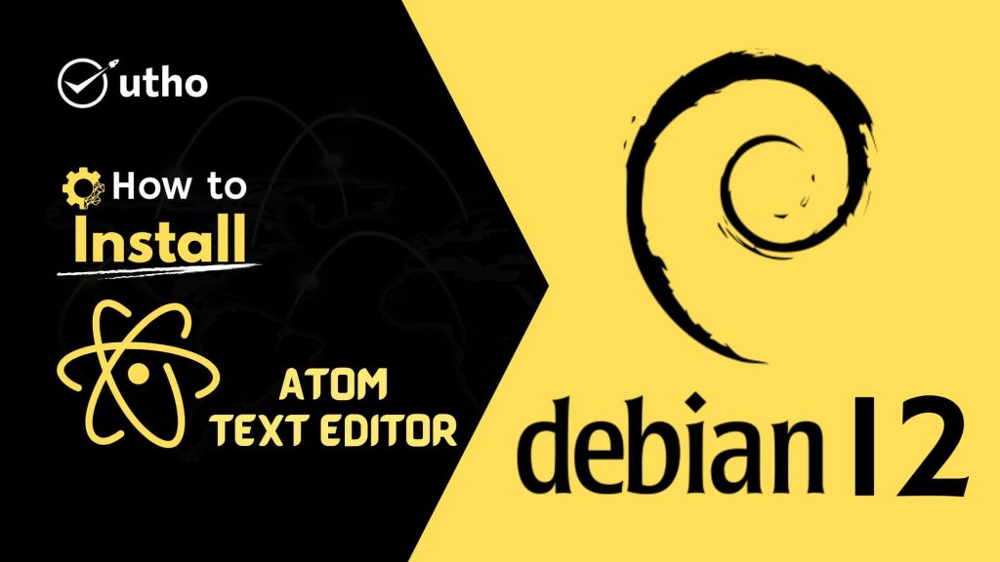

## Introduction

In this article, you will learn how to install Atom Text Editor on Debian 12.

[Atom](https://en.wikipedia.org/wiki/Atom_(text_editor)) is a cross-platform text editor that is built on open source and does not cost anything to use. It is compatible with macOS, Windows, and Linux-based operating systems such as Debian 12. It is also known as the hackable text editor in the technical generation that is currently living in the 21st century.

Because it supports a wide variety of add-ons, including dynamic linting, syntax highlighting for many languages and formats, debuggers, video and music player controls, and runtime environments, Atom is regarded as being more user-friendly than its rivals.

## Method 1: Atom on Debian 12 using APT

In order to successfully install Atom using APT on Debian 12, you will need to follow the step-by-step steps that are provided below.

##### Step 1: Update system repositories

**Open the terminal window on your Debian 12 computer and type in the following instructions to bring the system repositories up to date:**

```
# apt update

```

```
# apt upgrade -y

```

##### Step 2: Get the Atom GPG key here

**After the system repositories have been brought up to date, download the GPG key for Atom Editor:**

```
# wget -qO - https://packagecloud.io/AtomEditor/atom/gpgkey | apt-key add -

```


##### Step 3: Import information from the Atom repository

**Importing the Atom repository onto your system should be the next step, and the following command should be used to accomplish this:**

```
# sh -c 'echo "deb \[arch=amd64\] https://packagecloud.io/AtomEditor/atom/any/ any main" > /etc/apt/sources.list.d/atom.list'

```

**After you have imported the repository and installed the packages, it is highly advised that you then update your operating system.**

```
# apt update

```

##### Step 4: Atom install on Debian 12

**Using the command that has been provided below, you may now install Atom on Debian 12:**

```
# apt install atom -y

```

## Method 2: Installing Atom on Debian 12 with Snap Store

The Snap Store provides the second option for installing Atom on Debian 12, which can be found here. You may quickly and easily install Atom in just a few minutes by utilizing a single command provided by Snap Store.

##### Step 1: Snap Installation

**To begin, install Snap on your machine if it has not previously been done so:**

```
# apt install snapd

```


##### Step 2: Atom installation on Debian 12

**After installing Snap, run this command to install Atom:**

```
# snap install atom --classic

```


## Conclusion

Hopefully, now you have learned how to install Atom Text Editor on Debian 12.

Also Read: [How to Install NGINX Web Server on Ubuntu 22.04 LTS](https://utho.com/docs/tutorial/how-to-install-nginx-web-server-on-ubuntu-22-04-lts/)

Thank You 🙂
