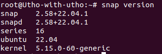

<figure>


<figcaption>

How to install Flutter on Debian server

</figcaption>

</figure>

In this article, you will learn how to install Flutter on Debian. [Snaps are programmes](https://en.wikipedia.org/wiki/Snap_(software)) that have all of their dependencies bundled and ready to run on all widely used Linux distributions from a single build. They automatically update and gracefully roll back.

The Snap Store, an app store with millions of users, allows users to find and download Snaps.

Snaps are safe because they are contained and sandboxed to prevent system compromise. They operate at various confinement levels, which refer to how isolated they are from one another and the base system. More significantly, each snap has a carefully chosen interface that the designer carefully considered depending on the requirements of the snap in order to enable access to particular system resources outside of its confinement, such as network access, desktop access, and more.

## Prerequesites

- Any normal user with SUDO privileges or Super user

- Internet enabled server with updated security patches

- Although, we have covered the installation of Snap on Debian server. but if you face any issue, you can follow [this guide](https://utho.com/docs/tutorial/how-to-install-snap-on-ubuntu-server/)

## Steps to install Snap on Debian server

Step 1: Update the APT repository to install the latest packages.

```
apt update
```
Step 2: Install the snap package using the below command.

```
apt install snapd
```
Step 3: Now, verify the installation of your snap package.

```
snap version
```

<figure>



<figcaption>

Snap version

</figcaption>

</figure>

Step 4: Install The flutter gdk on your server.

```
snap install flutter --classic
```
Step 5: Add the flutter tool to your path:

```
export PATH="$PATH:`pwd`/flutter/bin"
```
Step 6: Install the pre-defined binaries of flutter

```
flutter precache
```
<figure>


<figcaption>

Flutter installed on server

</figcaption>

</figure>

And this is how you will install Flutter SDK on Debian server
