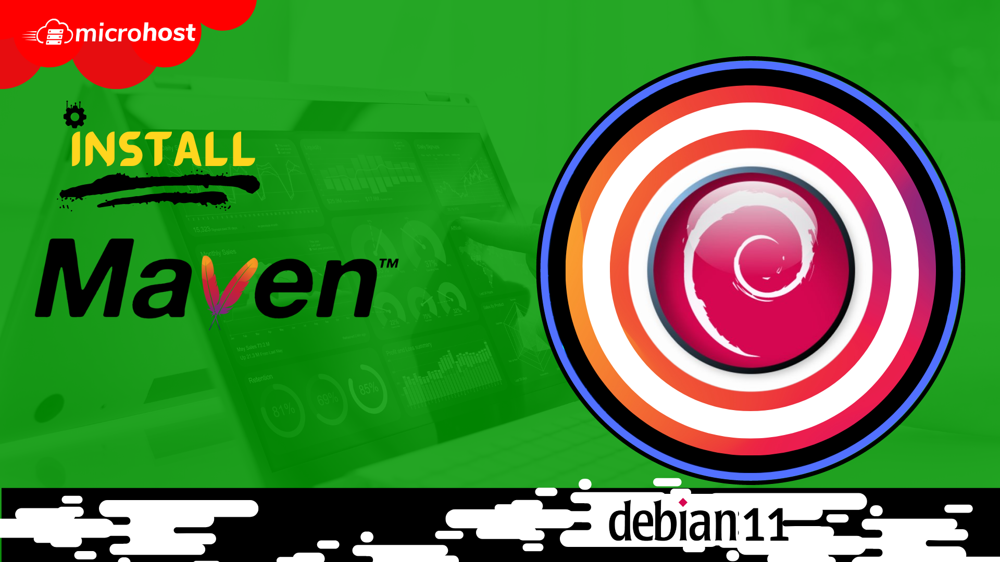

<figure>



<figcaption>

How to install Maven on Debian

</figcaption>

</figure>

In this article, you will learn how to install Maven on Debian 11 and Debian 10.

The Maven lesson explains both the basics and more advanced ideas of the Apache Maven technology. Our maven lesson is made for both newbies and experts. Maven is a strong tool for managing projects. It is built on POM, which stands for "project object model." It is used to make, keep track of, and record projects. Like ANT, it makes the building process easier. But it's too far ahead of ANT.

## Prerequisites

- Super user or any normal user with SUDO privileges.
- An updated APT repositories to install java and maven.
- Java installed on server. If you have did not installed Java on your server, you can follow this guide- [How to install Jenkins](https://utho.com/docs/tutorial/how-to-install-jenkins-on-debian-10/).

## Steps to install Maven on Debian

We have two Methods to install the Maven on Linux.

1. Using apt repositories
2. Using wget to download the latest version and work on it.

### 1\. Using apt command to install it

Step 1: Update the apt repositories before installing the Maven.

```
apt-get update
```
Step 2: Now, just install the maven using the below command.

```
apt-get install maven -y
```
<figure>


<figcaption>

Installing maven on Debian

</figcaption>

</figure>

Step 3: Now, Check the installed maven version on your server.

```
mvn -version
```
Step 4: Even if you did not installed the java yet, you will note that, installing the maven on your server already installed latest available version of the Java on your server.

```
java -version
```
<figure>


<figcaption>

Installed java version on your server

</figcaption>

</figure>

### 2\. Install the maven using wget command

Step 1: Visit the page where you can [download Maven](https://maven.apache.org/download.cgi) and choose the version you want to install. In the Files section, you can see the most recent version, and in the Previous Releases part, you can use the backup link to see older versions.

Step 2: Now, download the file using wget command.As this is a third party application, it would be best if we install it on any other directory than any user's home directory. Therefore, we will use the /opt directory, which is in linux for these types of situation

```
cd /opt ; wget <download-link-of-maven>
```
or

```
cd /opt ; wget https://dlcdn.apache.org/maven/maven-3/3.9.1/binaries/apache-maven-3.9.1-bin.tar.gz
```
Step 3: Now, unzip the file and rename it to make it more suitable.

```
tar -zxvf apache-maven-3.9.1-bin.tar.gz
mv apache-maven-3.9.1 maven
```
Step 4: Now, setup the Environment variable for your maven to make its binary executable from anywhere on your machine.

```
vi /etc/profile.d/maven.sh
```
And, now paste the below lines to this file.

> File content:
> 
> export M2\_HOME=/opt/maven # path to your maven folder  
> export MAVEN\_HOME=/opt/maven # again path to your maven folder  
> export PATH=$M2\_HOME/bin/:$PATH

Step 5: Now make this file executable and source this file.

```
chmod +x /etc/profile.d/maven.sh
```
```
source /etc/profile.d/maven.sh
```
Step 6: By this step, you have installed the maven on your system successfully. To check this, use the below command.

```
mvn -version
```
<figure>


<figcaption>

latest version of your Maven

</figcaption>

</figure>

And this is how you have installed maven on Debian machine.
