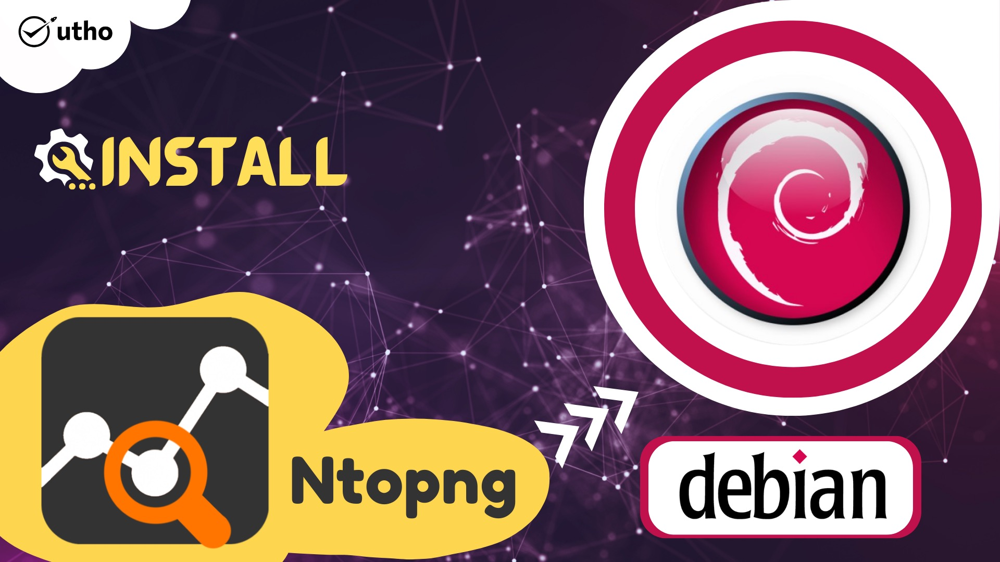
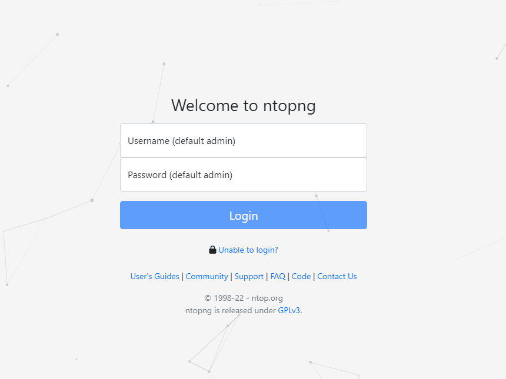

## Introduction

In this article, you will learn how to install Ntopng on Debian.

Ntopng is a piece of software that may be installed on a computer to monitor the traffic that occurs on a computer network. It is meant to serve as a high-performance and low-resource alternative to the ntop programme. The phrase "next generation" is where the name comes from. ntopng is software that is freely available to the public and is distributed with the GNU General Public License version 3 ([GPLv3](https://en.wikipedia.org/wiki/GNU_General_Public_License#Version_3)).

There are versions of the source code available for the following operating systems: Windows, Unix, Linux, and both Mac OS X and BSD. CentOS, Ubuntu, and OS X all have binary versions of this software available. There is a demo binary for Windows users that restricts the amount of data that may be analysed to 2,000 packets. C++ is the programming language that was used to create the ntopng engine. Lua is used for the development of the web interface, which is optional.

Ntopng makes use of nDPI for [protocol](https://utho.com/docs/tutorial/how-to-troubleshoot-with-nmap-in-centos/) identification, allows geolocation of hosts, and is capable of displaying real-time flow analysis for connected hosts. It does all of these things by relying on the key-value server Redis rather than a regular database.

## Step 1: Install Ntopng

1 .Include required dependencies in your application.

```
# apt install wget gnupg software-properties-common
```

2. The Ntopng repository package can be downloaded and installed here.

```
# wget http://apt.ntop.org/buster/all/apt-ntop.deb
```

```
# dpkg -i apt-ntop.deb
```

3\. update your server.

```
# apt upgrade -y
```

```
# apt update -y
```

4\. Install Ntopng.

```
# apt install pfring-dkms nprobe ntopng n2disk cento -y
```

## Step 2: Configure Ntopng

1\. Identify which network interfaces your server uses.

```
# ntopng -h
```

At the very bottom of the page, Ntopng lists all of the interfaces that are currently available to you.


2\. Open the Ntopng configuration file.

```
# vi /etc/ntopng/ntopng.conf
```

3\. Add these lines to the end of the file.

```
Network adapter name
```
-i=2

```
HTTP port of the embedded web server.
```
-w=3000    
```

4\. It is required to restart the ntopng service and configure it to run automatically at boot.

```
# systemctl start ntopng
```

```
# systemctl enable ntopng
```

```
# systemctl status ntopng
```


5\. Open the port used by the web server in any firewall software, such as ufw.

```
# ufw allow 3000
```


## Step 3: Test Ntopng

Proceed to your web interface, which is located at port 3000. In this example, you should substitute the IP address of your server.

```
# http://Server_IP:3000
```

Please log in using the username admin



## Conclusion

Hopefully, you have learned how to install Ntopng on Debian.

Thank You 🙂
