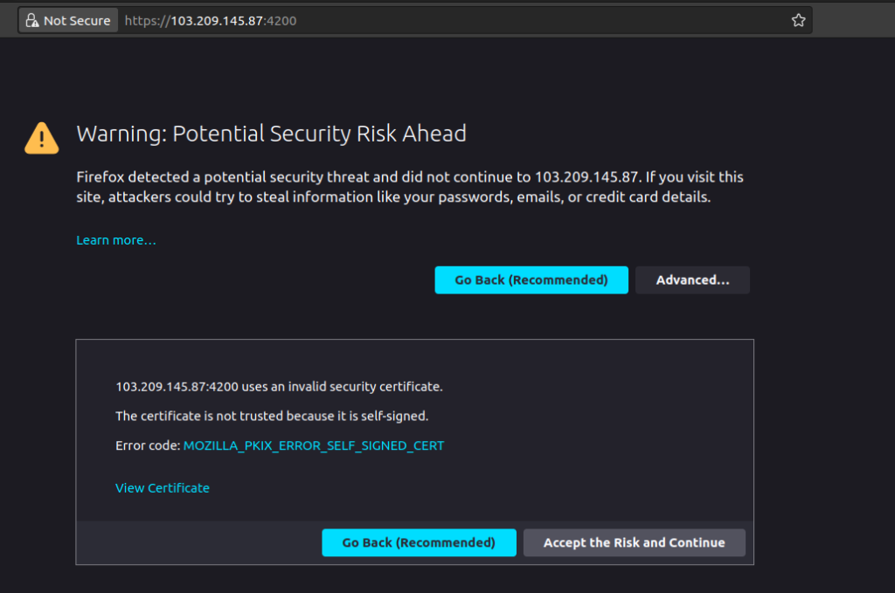
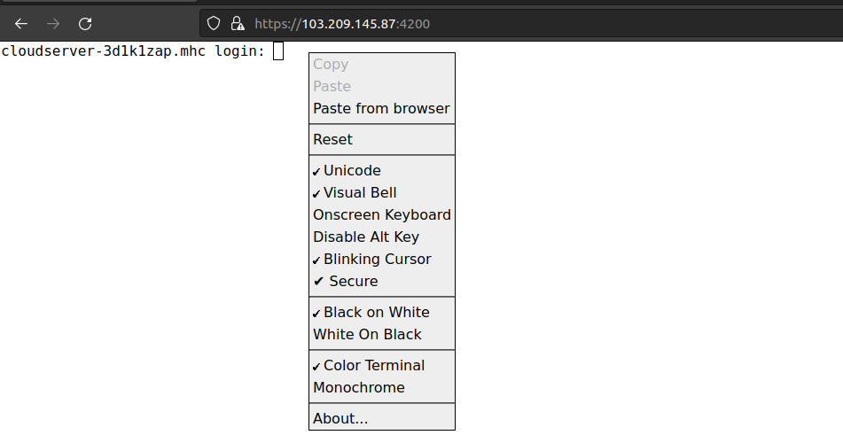

<figure>


<figcaption>

How to install Shellinabox on Debian server

</figcaption>

</figure>

In this tutorial, we will learn how to install Shellinabox on Debian server. Before installing Shellinabox on Debian server to use the browser to access the Debian terminal, we need to figure out how to do that. Markus Gutschke made Shell in a Box, and its name is pronounced "shellin' box." It is a web-based programme that acts like a terminal. It gives you a web terminal emulator that lets you access and control your Linux Server SSH Shell remotely from any browser that supports AJAX/JavaScript and CSS, without the need for additional browser plugins like FireSSH. It has a web server built in that works as a web-based SSH client on a certain port. This web server also works as an SSH client that runs on the web.

In this article, we'll talk about how to install Shellinabox and connect to a remote SSH terminal using any modern web browser. Any system can use Shellinabox. When you are behind a firewall and can only let HTTP(s) traffic through, Web-based SSH is a very useful tool.

## Overview:

Shellinabox is included by default on many Linux distributions, such as Debian, Ubuntu, and Linux Mint, through their default repositories.

## Prerequisites:

- Super user( root) or any normal user with SUDO privileges.
- apt repositories enabled and available to install packages.

## 1- Installation

To install the Shellinabox on your Ubuntu server, first update the apt repository on it. To do so, use the below command.

```
apt update
```
And now you can install the shellinabox on your machine.

```
apt install shellinabox -y
systemctl start shellinabox
systemctl enable shellinabox
```
## 2- Configure Shellinabox

You will find the configuration file has a different name and directory in which it is present as you go from one Linux flavor to another. In Debian the configuration file can be found as- /etc/default/shellinabox

```
vi /etc/default/shellinaboxd
```
```
Content of /etc/default/shellinabox:

```
Should shellinaboxd start automatically
```SHELLINABOX_DAEMON_START=1

```
TCP port that shellinboxd's webserver listens on
```SHELLINABOX_PORT=4200

```
Parameters that are managed by the system and usually should not need
changing:
SHELLINABOX_DATADIR=/var/lib/shellinabox
SHELLINABOX_USER=shellinabox
SHELLINABOX_GROUP=shellinabox
```
```
Any optional arguments (e.g. extra service definitions).  Make sure
that that argument is quoted.
```#
```
Beeps are disabled because of reports of the VLC plugin crashing
  Firefox on Linux/x86_64.
```SHELLINABOX_ARGS="--no-beep"
```

## 3- Points to remember:

- For security reasons, we should change the default port number of shellinabox service.
- Make sure to enable the shellinabox port in your firewall( if you are using one)

## 4- Verify the port and running status of Shellinabox

[Using the netstat command](http://microhost.com/docs/tutorial/how-to-real-time-monitor-tcp-and-udp-ports/(opens in a new tab)), you can see the all the listening tcp and udp ports of your server.

```
netstat -tunlp | grep shellinaboxd
```
<figure>


<figcaption>

listening port of shellinabox

</figcaption>

</figure>

Now, open your web browser and go to https://Your-IP-Address:4200. You should be able to see an SSH terminal that runs on the web. When you log in with your username and password, you should see your shell prompt.

After you hit the browser with your serverip and port number, you will see a warning page on which it is showing a security risk. This warning is showing because of lack of ssl on your server for this site. To ignore this, press 'Advanced' and then 'Accept and Continue'

<figure>



<figcaption>

security page of browser

</figcaption>

</figure>

After this, you will see a blank white screen prompt which will ask you the username similar to which you see on your ssh prompt. Here, enter the username, from which you want to login. After username it will ask you the password.

For entering the password, you can enter it either by typing manually or just right click on your browser screen and select 'Paste from browser' and paste the password on the next windows.

<figure>



<figcaption>

To paste password on your browser

</figcaption>

</figure>

After entering the password on the below like screen, either press enter or click on 'ok'

<figure>


<figcaption>

click 'ok' to paste the content

</figcaption>

</figure>

After successfully loging in to your server, you can use your browser same as you use your ssh login.

<figure>


<figcaption>

login prompt of the server

</figcaption>

</figure>

In this tutorial, you have learnt how to install Shellinabox on Debian server.

Also Read: [Install SSL on Ubuntu server using Nginx](https://utho.com/docs/tutorial/install-ssl-on-ubuntu-server-using-nginx/), [How to install SSL on CentOS-7.3 with httpd server](https://utho.com/docs/tutorial/how-to-install-ssl-on-centos-7-3-with-httpd-server/)
