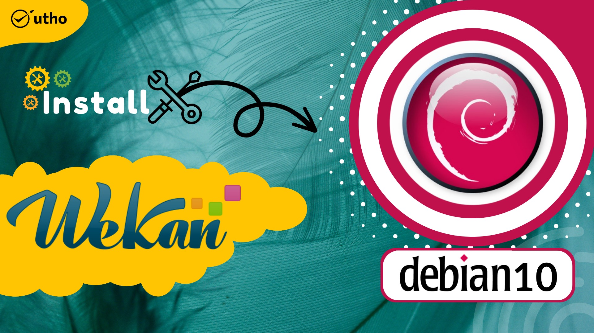
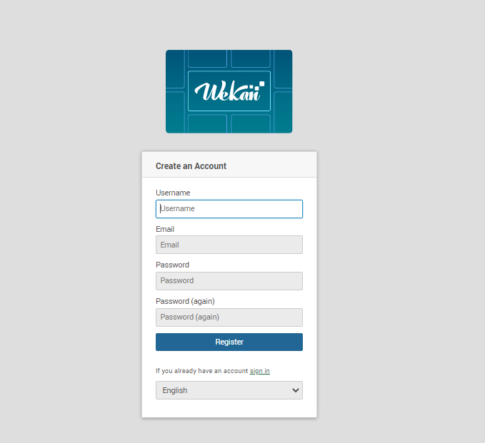

## Introduction

In this article, you will learn how to install wekan on Debian 10.

Wekan is a free and open-source [Kanban Board](https://en.wikipedia.org/wiki/Kanban_board) software that is built on the Meteor JavaScript framework. Its primary purpose is to facilitate the management of projects and tasks through the use of cards. Using Wekan allows you to quickly and simply invite team members to the board, define tasks, and assign them to your member within a certain time frame. Because of all of these features, using Wekan is an excellent solution for enabling project cooperation among engineers or other teams. When a task is divided among members of a team, more productivity is achieved in a shorter amount of time as a direct result of this increased efficiency. It is a web programme that is similar to Trello that allows you to accomplish a wide variety of activities while having a small learning curve and a simplified user interface.

When compared to other [tools](https://utho.com/docs/tutorial/how-to-install-php-8-on-debian-10/) in its class, such as Trello, the most apparent advantage of utilising Wekan is that it enables anyone to easily contribute to and alter the content of the platform. You will have full control over it on your own, eliminating the need to rely on a service provided by a third party. You will also have the ability to host it on your own server, giving you full control over the information you store as well as the flexibility to use it anyway you see appropriate.

You will learn how to install Wekan on a server running Debian 10 by reading this tutorial.

## Step 1\. Install and Configure Wekan

Update system packages.

```
# apt update
```

Install snap. Snap is a software distribution and package management system that was developed by Canonical.

```
# apt install snapd -y
```

Install Wekan.

```
# snap install wekan
```

Establish a web URL root for use with Wekan.

```
# snap set wekan root-url="http://your_server_ip"
```

Set Wekan http port.

```
# snap set wekan port='80'
```

Reboot the snap server's MongoDB service.

```
# systemctl restart snap.wekan.mongodb
```

Restart Wekan service on snap.

```
# systemctl restart snap.wekan.wekan
```

Check status.

```
# ss -tunelp | grep 80
```

Make the Wekan service auto-start at system boot.

```
# snap enable wekan
```

Install MongoDB tools.

```
# apt install mongo-tools -y
```

Restart Wekan.

```
# systemctl restart snap.wekan.wekan
```

Create a schedule for Snap Auto-updates to run between 2:00 AM and 4:00 AM, at which point updates will be installed automatically.

```
# snap set core refresh.schedule=02:00-04:00
```

Reload snap.

```
# snap refresh
```

## Step 2. Access Wekan Web Interface

Before you can access the dashboard, you'll need an administrator account. Using a web browser, go to http://ServerIP/sign-up to visit the sign-up page and create an account. If you choose to create a Wekan account, you will be taken directly to the dashboard after account activation. For instance:

```
# http://ServerIP/sign-up
```



## Conclusion

Congratulations, your server now has Wekan installed. The control panel is now available, and you can start making and managing cards right away.

I hope you have learned how to install wekan on Debian 10.

Thank You 🙂
