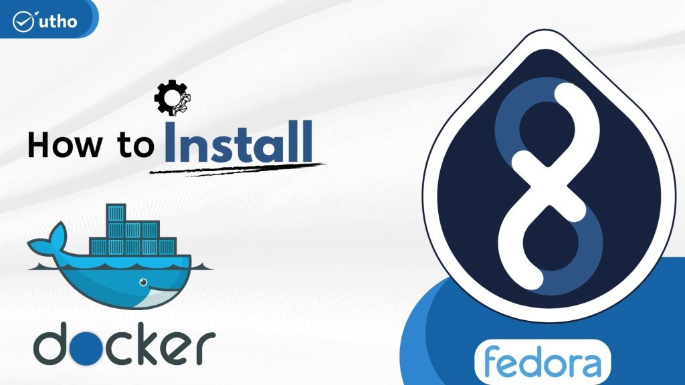
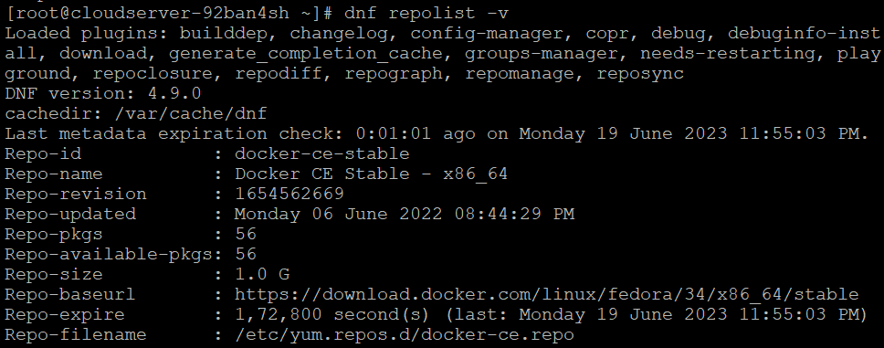
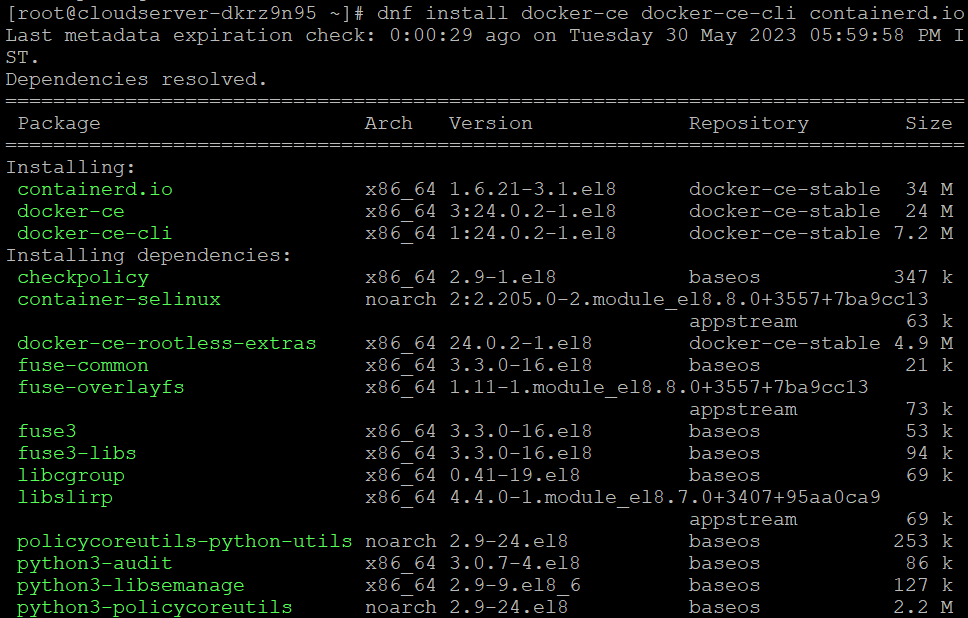
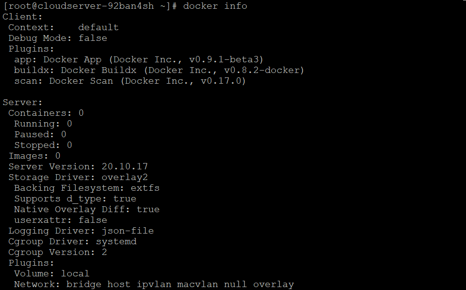

## Introduction

In this article, you will learn how to install Docker on Fedora.

[Docker](https://en.wikipedia.org/wiki/Docker_(software)) is a platform that is open source and allows developers to build, deploy, run, update, and manage containers. Containers are standardised, executable components that combine application source code with the (OS) libraries and dependencies necessary to run that code in any environment. Docker enables developers to do all of these things.

Containers make it easier to design and deliver applications that run on distributed systems. As more and more businesses move their operations to cloud-native development and hybrid multicloud environments, their adoption rates have increased significantly.

Developers have the ability to create containers even without the use of Docker by cooperating directly with features that are pre-installed in Linux and other operating systems. Docker, on the other hand, makes containerization more quickly, easily, and securely.

#### Step 1: Add Docker Repo

**You will need to add the official Docker CE repository to your AlmaLinux 8 system in order for us to be able to install Docker without having to manually download its docker packages.**

```
# dnf config-manager --add-repo https://download.docker.com/linux/fedora/docker-ce.repo

```

#### Step 2: Update the system

**In order for the system to recognise the newly added Docker repository and the packages that are available in it, you will need to execute the system update, which will lead Fedora to rebuild the system's repo cache.**

```
# dnf update -y

```

**Using the following command, you may verify the newly added repository in addition to the ones on your system:**

```
# dnf repolist -v

```



#### Step 3: Install Docker

**Now that we have the Docker repository, it is necessary to install the Docker-CE together with its command-line tool and containerd.io so that we can effectively control the container lifecycle of the system on which it is hosted. To do this, we will perform a simple command using the DNF package manager.**

```
# dnf install docker-ce docker-ce-cli containerd.io

```



#### Step 4: Start Docker Services

**After the installation has been finished, you should start the Docker service on your Fedora computer and also make it such that it starts automatically whenever the system does.**

```
# systemctl enable docker

```

```
# systemctl start docker

```

**Check the Service Status to see if it's working accurate.**

```
# systemctl status docker

```


**To get information and details about the docker installer, such as the version, the number of containers that have been loaded, the host kernel version, the architecture, the CPU, the name of the operating system, etc.**

```
# docker info

```



## Conclusion

Hopefully, now you have learned how to install Docker on Fedora.

**Also Read:** [How to Use Iperf to Test Network Performance](https://utho.com/docs/tutorial/how-to-use-iperf-to-test-network-performance/)

Thank You 🙂
