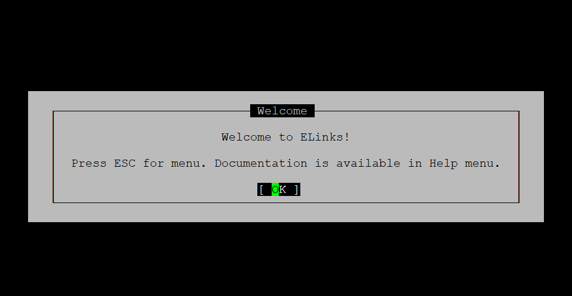
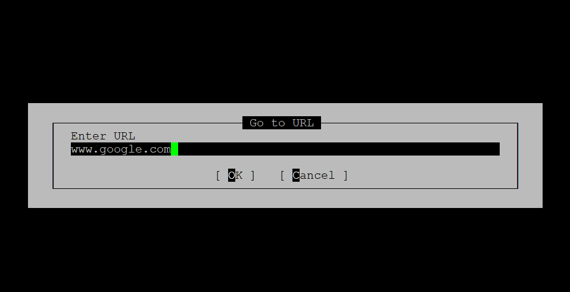
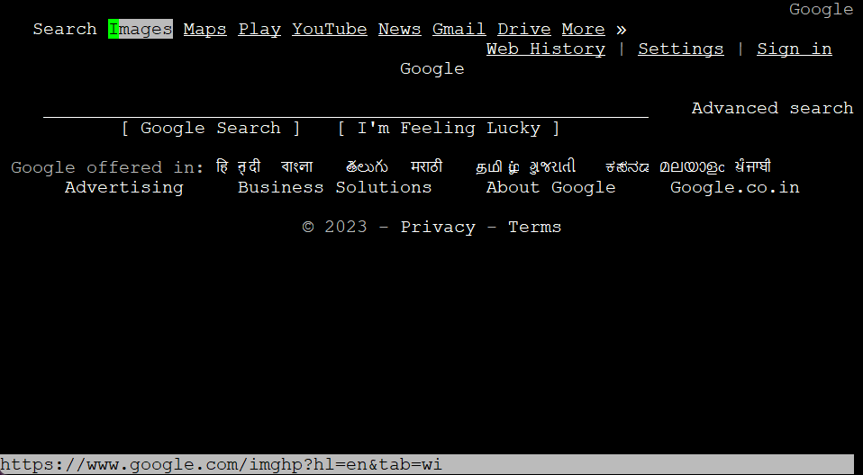

## Introduction

In this article, you will learn how to install Elinks on Fedora.

[Elinks](https://en.wikipedia.org/wiki/ELinks) is a free text-based web browser that is compatible with operating systems that are similar to Unix. In the latter half of 2001, Petr Baudi created a fork of the Links Web browser that he referred to as the E branch for its focus on experimentation. Since then, the E has come to represent either Enhanced or Extended in many contexts.

Elinks is a text-mode Web browser that can show colours, render tables, download in the background, be set up with a menu, search with tabs, and use thin code. Frames are okay. Various file types can be linked to external readers. Mail-to and telnet are supported by viewers on the outside.

## Fedora Elinks Web browser installation

**Step 1: We will use the following command to update our operating system.**

```
# dnf update -y

```

**Step 2: The Elinks package can be found in the Fedora repository. It is not only the easiest way but also the best way to load a package from a distribution's main repository. To start the installation, use the command below.**

```
# dnf install elinks -y

```

**Step 3: Start the Internet browser. Now that we've installed the browser, we'll run this command and see what happens.**

```
# elinks

```

**The following screen will show up on your terminal when the link is made. You will get a browser instead of an actual computer. It will be fully functional and show all of the text on a page.**

**Step 4: Press "OK"**



**Now we have successfully installed the Elinks web browser on our Fedora operating system.**

**Step 5: Type the URL and then press "OK".**



**After pressing OK, below content will show in your terminal.**



## Conclusion

Hopefully, now you have learned how to install Elinks on Fedora.

**Also Read:** [How to Use Iperf to Test Network Performance](https://utho.com/docs/tutorial/how-to-use-iperf-to-test-network-performance/)

Thank You 🙂
