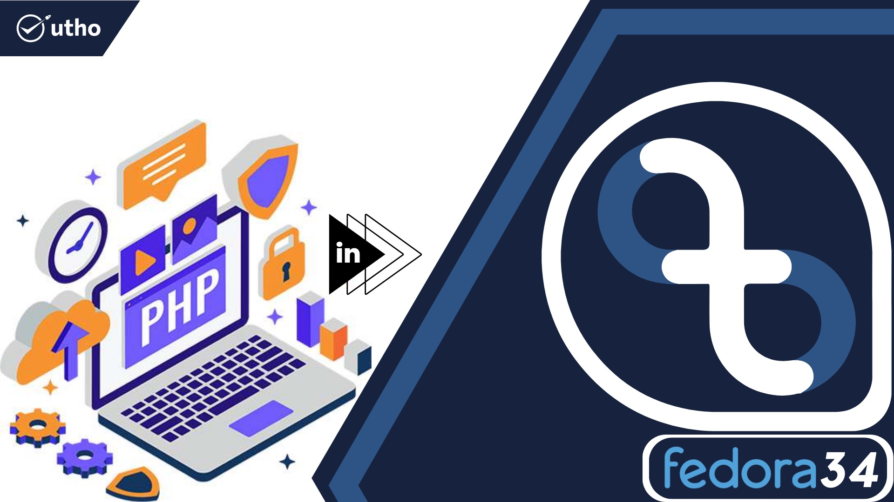

## Introduction

In this article you will learn how to install PHP 8.0 on Fedora 34.

[PHP](https://en.wikipedia.org/wiki/PHP) is the most widely used server-side scripting language in creation of dynamic web pages. PHP applications usually work well with HTML and interact with relation database management systems, here are the steps to Install PHP 8 on Fedora 34.

PHP is an open-source server-side programming language that may be used to construct a wide range of various things, such as websites, applications, and customer relationship management systems. PHP is a server-side programming language. It is a programming language that may be used for a variety of purposes and is rather popular. Additionally, it can be included into HTML. Because PHP can work with HTML, it has remained one of the most widely used programming languages in the [development](https://utho.com/docs/tutorial/how-to-install-git-on-fedora/) community. This is due to the fact that PHP contributes to the simplification of the HTML code.

The phrase "PHP: Hypertext Preprocessor" is what the acronym PHP refers to, with the "PHP" in PHP initially standing for "Personal Home Page" inside this abbreviation. Since its creation in 1994, the phrase has gone through a number of modifications in order to provide a more accurate description of the nature of the entity to which it refers.

For nearly three decades, PHP has been a go-to language for web development thanks to its many features and flexibility.

## Install PHP 8.0 on Fedora using Remi repository

Update your Fedora system.

```
# dnf -y update
```

```
# dnf -y install http://rpms.remirepo.net/fedora/remi-release-34.rpm
```

After the repository has been installed, you will need to enable the one that has the version of PHP that you require. See the example below below:

```
# dnf -y install dnf-plugins-core
```

```
# dnf config-manager --set-enabled remi
```

```
# dnf module reset php -y
```

```
# dnf module -y install php:remi-8.0
```

Install PHP extensions using the name format php-. Example:

```
# dnf -y install php-cli php-fpm php-mysqlnd php-zip php-devel php-gd php-mcrypt php-mbstring php-curl php-xml php-pear php-bcmath php-json
```

It appears like PHP has been successfully installed on Fedora:

```
# php -v
```


## Conclusion

I hope you have learned how to install PHP 8 on Fedora 34.

Thank You 🙂
