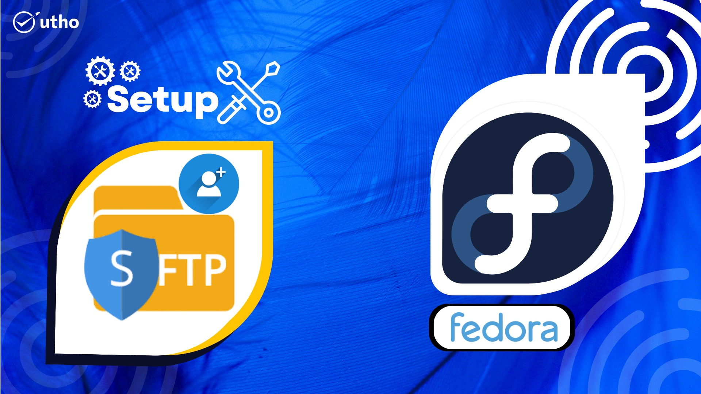

## Introduction

In this article you will know about how to Setup SFTP User Account on Fedora.

A secure shell ([SSH](https://en.wikipedia.org/wiki/Secure_Shell)) session is required for the use of the Secure File Transfer Protocol (SFTP), which is a secure method for exchanging data between a local and distant computer. It is an upgraded version of the standard file transfer protocol (FTP), which adds an additional layer of protection during the process of transferring files and establishing a connection.

In this tutorial, you will learn how to set up SFTP User account on Fedora and enable the user to only access files that are located within the user's home directory.

## Make a new group for SFTP users and join it. You should provide the name of the group you want instead of sftpcorner.

```
# groupadd sftpcorner
```

Make a brand-new account for the user. Simply replace "exampleuser" with the user name you want to use.

```
# adduser exampleuser
```

Please create a password for exampleuser.

```
# passwd example
```

After that, the user should be added to the SFTP group.

```
# usermod -G sftpcorner exampleuser
```

Put access restrictions on the user so they can't access files outside of their home directory.

```
# chown root:root /home/exampleuser
```

Now, within the user's home directory, create new subdirectories. These are used in the process of file transfer.

```
# mkdir /home/exampleuser/uploads
```

Give the user ownership of the subdirectories and files in the directory.

```
# chown -R exampleuser:exampleuser /home/exampleuser/uploads
```

The next step is to give the user permission to read and write all of the files contained within their home directory.

```
# chmod -R 755 /home/exampleuser/
```

## Configure SFTP

After creating the user accounts and the sftp group, you will need to enable SFTP in the primary SSH configuration file.

```
# vi /etc/ssh/sshd_config
```

**\# line 123: comment out and add a line**

```
#Subsystem      sftp    /usr/libexec/openssh/sftp-server
Subsystem       sftp    internal-sftp
```


Add the following lines to the end of the file. Replace sftpcorner with your actual sftp group.

```
Match Group sftpcornerChrootDirectory %hPasswordAuthentication yesAllowTcpForwarding noX11Forwarding noForceCommand internal-sftp
```

Save and close the file by escape :wq

Restart the SSH server for changes to take effect.

```
# systemctl restart sshd
```

## Login to SFTP

```
# sftp exampleuser@Server_IP
```

List files within the directory. Your output should be similar to the one below:

exampleuser@Server\_IP's password:

Connected to server\_IP

FileZilla and Cyberduck are the most popular SFTP clients available for Windows, Mac, and Linux desktop to test connectivity using a desktop client.

## Conclusion

In this guide, you successfully setup SFTP user Account on Fedora server, then tested connectivity through a terminal session and FileZilla. You can create multiple users with different directories to securely upload and download files on your server.

Know, [How to Install MongoDB on Fedora 36/35/34](https://utho.com/docs/tutorial/how-to-install-mongodb-on-fedora-36-35-34/)

Thank You 🙂
