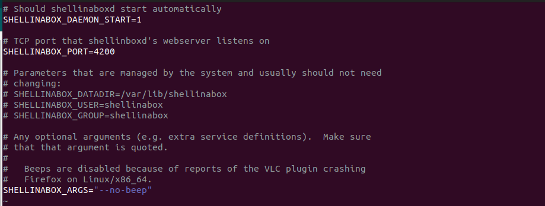

<figure>


<figcaption>

How to access Ubuntu terminal by browser: Shellinabox

</figcaption>

</figure>

In this tutorial, we will learn how to access Ubuntu terminal by browser: [Shellinabox](https://code.google.com/archive/p/shellinabox/). Before access Ubuntu terminal by browser, we need to how we will do that. Markus Gutschke made Shell In A Box, which you say as "shellinabox." It is a web-based terminal emulator. It has a built-in web server that runs as a web-based SSH client on a specified port and gives you a web terminal emulator to access and control your Linux Server SSH Shell remotely using any AJAX/JavaScript and CSS enabled browsers without the need for additional browser plugins like FireSSH.

In this tutorial, we will see how to install Shellinabox and use a modern web browser on any machine to connect to a remote SSH terminal. When you are behind a firewall and only HTTP(s) traffic can get through, Web-based SSH is very helpful.

## Overview:

Shellinabox is included by default on many Linux distributions, such as Debian, Ubuntu, and Linux Mint, through their default repositories.

## Prerequisites:

- Super user( root) or any normal user with SUDO privileges.
- apt repositories enabled and available to install packages.

## 1- Installation

To install the Shellinabox on your Ubuntu server, first update the apt repository on it. To do so, use the below command.  
```
# apt update 
```

And now you can install the shellinabox on your machine.

```
# apt install shellinabox -y  
```
# systemctl start shellinabox  

```
```
# systemctl enable shellinabox
```

```

## 2- Configure Shellinabox

The configuration file has a different name and directory in which it is present as you go from one Linux flavour to another. In Debian the configuration file can be found as- /etc/sysconfig/shellinaboxd

```
# vi /etc/default/shellinabox 
```

<figure>



<figcaption>

content of /etc/defaults/shellinaboxd

</figcaption>

</figure>

## 3- Points to remember:

- For security reasons, we should change the default port number of shellinabox service.
- Make sure to enable the shellinabox port in your firewall( if you are using one)

## 4- Verify the port and running status of Shellinabox

Using the [netstat command](https://utho.com/docs/tutorial/how-to-real-time-monitor-tcp-and-udp-ports/), you can see the all the listening tcp and udp ports of your server.

```
# netstat -tunlp | grep shellinaboxd 
```

> Output: tcp 0 0 0.0.0.0:4200 0.0.0.0:\* LISTEN 70563/shellinaboxd

Now, open your web browser and go to https://Your-IP-Address:4200. You should be able to see an SSH terminal that runs on the web. When you log in with your username and password, you should see your shell prompt.

After you hit the browser with your serverip and port number, you will see a warning page on which it is showing a security risk. This warning is showing because of lack of ssl on your server for this site. To ignore this, press 'Advanced' and then 'Accept and Continue'

<figure>


<figcaption>

security page of browser

</figcaption>

</figure>

After this, you will see a blank white screen prompt which will ask you the username similar to which you see on your ssh prompt. Here, enter the username, from which you want to login. After username it will ask you the password.

For entering the password, you can enter it either by typing manually or just right click on your browser screen and select 'Paste from browser' and paste the password on the next windows.

<figure>


<figcaption>

To paste password on your browser

</figcaption>

</figure>

After entering the password on the below like screen, either press enter or click on 'ok'

<figure>


<figcaption>

click 'ok' to paste the content

</figcaption>

</figure>

After successfully loging in to your server, you can use your browser same as you use your ssh login.

<figure>


<figcaption>

login prompt of the server

</figcaption>

</figure>

In this tutorial, you have learnt how to access Ubuntu terminal by browser: Shellinabox

Also Read: [How to Install NGINX in Debian 10](https://utho.com/docs/tutorial/how-to-install-nginx-in-debian-10/), [How To Create Redirects with Nginx](https://utho.com/docs/tutorial/how-to-create-redirects-with-nginx/)
