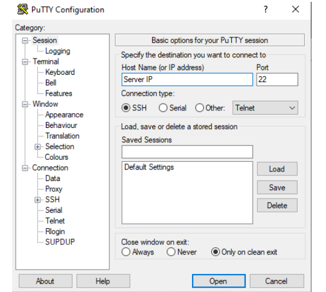
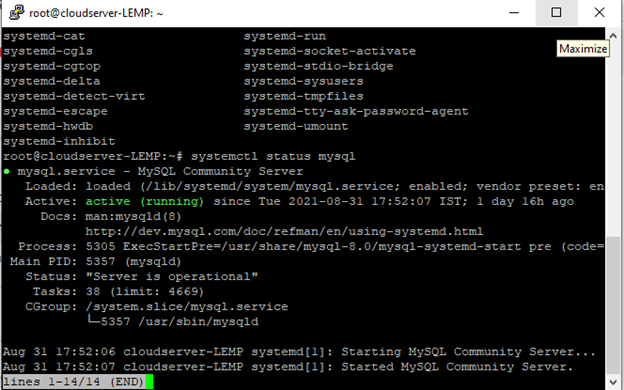

**Introduction**

The LEMP software stack is a group of software that can be used to serve dynamic web pages and web applications. This is an acronym that describes a Linux operating system, with an nginx (pronounced like “**E**ngine-X”) web server. The backend data is stored in the MySQL database and the dynamic processing is handled by PHP.

1. **Login to the server with the with the root credential on the putty.**



After login make sure to update the packages, to do so type the command bellow

```
# sudo apt update 
```

After successfully update, type the following command for installation.

```
# sudo apt install nginx 
```

After successfully installation we need to start the service for that type the following command.

```
# Systemctl start nginx
```

After start the service you can check the status, with the following command.

```
# Systemctl status nginx 
```


2. Installing MySQL to Manage Site Data
    
    Now that you have a web server, you need to install MySQL (a database management system) to store and manage the data for your site.
    
    Install MySQL by typing:
    
    ```
#  sudo apt install mysql-server 
```
    
    After successfully installation we need to start the service for that type the following command.
    
    ```
# Systemctl start mysql 
```
    
    After start the service you can check the status, with the following command.
    
    ```
# Systemctl status mysql 
```
    
    
    
    The MySQL database software is now installed, but its configuration is not yet complete.
    
    To secure the installation, MySQL comes with a script that will ask whether we want to modify some insecure defaults. Initiate the script by typing.
    
    ```
# sudo mysql_secure_installation 
```
    
    This script will ask if you want to configure the `VALIDATE PASSWORD PLUGIN`.
    
    Answer `Y` for yes, or anything else to continue without enabling.
    
    VALIDATE PASSWORD PLUGIN can be used to test passwords
    
    and improve security. It checks the strength of password
    
    and allows the users to set only those passwords which are
    
    secure enough. Would you like to setup VALIDATE PASSWORD plugin?
    
    Press y|Y for Yes, any other key for No.
    
    Next, you’ll be asked to submit and confirm a root password.
    
    For the rest of the questions, you should press `Y` and hit the `ENTER` key at each prompt. This will remove some anonymous users and the test database, disable remote root logins, and load these new rules so that MySQL immediately respects the changes we have made.
    
    3. Installing PHP
        
        You now have Nginx installed to serve your pages and MySQL installed to store and manage your data. However, you still don’t have anything that can generate dynamic content. This is where PHP comes into play, for installation type the following command.
        
        ```
# sudo apt update 
```
        
        ```
# sudo apt install php-fpm php-mysql 
```
        
        Once installed, check the PHP version.
        
        ```
# php -v 
```
        
        f PHP was installed correctly, you should see something similar to below.
        
        Above we are using PHP version **8.0,** though this may be a later version for you depending on which package was in the repository.
        
        ## Configure Nginx for PHP
        
        We now need to make some changes to our Nginx server block.
        
        For the moment, we will assume you are using the default. Edit the file in nano.
        
        ```
# sudo nano /etc/nginx/sites-available/default 
```
        
        Press CTRL + W and search for index.html.
        
        Now add index.php before index.html
        
        Now check the config file to make sure there are no syntax errors. Any errors could crash the web server on restart.
        
        ```
# sudo nginx -t 
```
        
        Thank You :)
