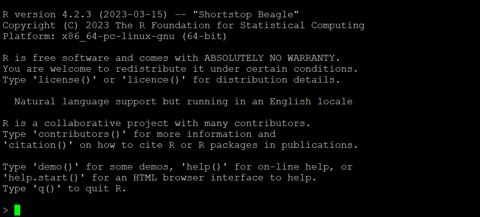

## Introduction

In this article, you will learn how to install R on Ubuntu 22.04.

[R](https://en.wikipedia.org/wiki/R_(programming_language)) is a popular open-source programming language that is utilized frequently in the processes of data analysis and statistical computing. It is a programming language that is supported by the R Foundation for Statistical Computing and is growing in popularity.

It is also extendable and has an active community. R has a large number of user-created packages that cater to specialized fields of research, which broadens the scope of its use.

## Step 1: Installing R

You will begin by adding the external repository that is maintained by CRAN. This is necessary since R is a rapidly developing project, and the most recent stable version isn't always available from the repositories provided by Ubuntu.

You'll need to download and install the key.

```
# wget -qO- https://cloud.r-project.org/bin/linux/ubuntu/marutter\_pubkey.asc | gpg --dearmor -o /usr/share/keyrings/r-project.gpg

```

The next step is to add the R source list to the sources.list.d directory, which is the location where APT will look for new sources:

```
# echo "deb \[signed-by=/usr/share/keyrings/r-project.gpg\] https://cloud.r-project.org/bin/linux/ubuntu jammy-cran40/" | tee -a /etc/apt/sources.list.d/r-project.list

```

**After that, make sure that your package lists are up to date so that APT can read the new R source:**

```
# apt update

```

**You are now prepared to install R using the following command, as it has become available to you at this time.**

```
# apt install --no-install-recommends r-base

```

If you are asked to confirm the installation, press the word y to proceed. The \--no-install-recommends argument prevents any additional software from being installed on the system.

**When you start R using the following command, the most recent stable version of R available from CRAN is 4.2.0, which is displayed. This information is accurate as of the time this article was written.**

```
# sudo -i R

```



This verifies that you were able to install R correctly and enter its interactive shell properly.

## Step 2: Installing R Packages from the CRAN

**R's strength is that it has a lot of packages that can be added to it. For demonstration reasons, you will install txtplot, a package that makes ASCII graphs like scatterplot, line plot, density plot, acf, and bar charts:**

\> install.packages('txtplot')


Load the txtplot library when the installation is done:

\> library('txtplot')

If there are no error messages, it means that the library has loaded correctly.

## Conclusion

Hopefully, now you have learned how to install R on Ubuntu 22.04.

Also Read: [How to Install NGINX Web Server on Ubuntu 22.04 LTS](https://utho.com/docs/tutorial/how-to-install-nginx-web-server-on-ubuntu-22-04-lts/)

Thank You 🙂
