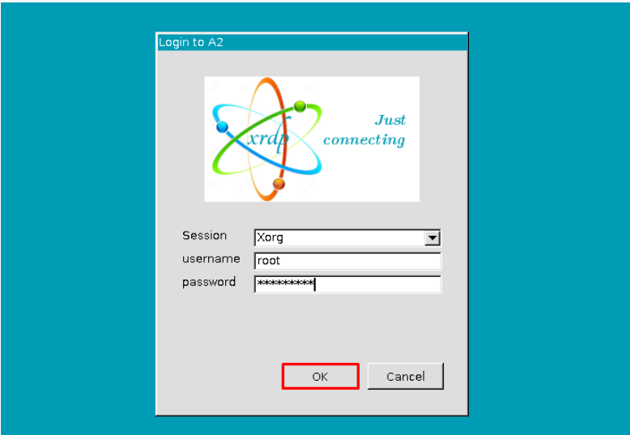

Xrdp is an open-source implementation of the Microsoft [Remote Desktop Protocol](https://en.wikipedia.org/wiki/Remote_Desktop_Protocol) (RDP) that allows you to control a remote system graphically .

In this tutorial, we will learn how to install and configure Xrdp server on Ubuntu 20.04.

**Installing Desktop Environment**

Ubuntu servers are operated via the command line and do not have pre-installed desktop environment.  
There are multiple desktop environments available in Ubuntu repositories that you can select. Here we are going to install Gnome, which is the default desktop environment in [Ubuntu 20.04](https://utho.com/docs/tutorial/how-to-install-mariadb-10-3-on-ubuntu-20-04/).

**Install Gnome**  
To install the Ubuntu desktop environment, run the command:

```
$ sudo apt update
```

```
$ sudo apt install ubuntu-desktop
```

**Installing Xrdp**  
Xrdp is incuded in the default Ubuntu repositories. To install it, run:

```
$ sudo apt install xrdp
```  
Once the installation is complete, the Xrdp service will automatically start. You can verify it by typing:  
```
$ sudo systemctl status xrdp
```

Output will look like this –


The output shows that, the xrdp daemon is active and running.  
The Xrdp daemon listens on port 3389 on all interfaces. If you are using firewall on ubuntu server then you need to open Xrdp port.

```
$ sudo ufw allow 3389
```

**Connecting to the Xrdp Server**  
Now that you have set up your Xrdp server, its time to open your Xrdp client and connect to the server.  
If you have a Windows PC, you can use the default RDP client. This will open up the RDP client. In the “Computer” field, enter the remote server IP address and click “Connect”


On the login screen, enter your username and password and click “OK”.  


You can see the default Gnome desktop after logging in. This is what it should look like:  


If you are running macOS, you can install the Microsoft Remote Desktop application from the Mac App Store. Linux users can use an RDP client such as Remmina

Configuring a remote desktop allows you to manage your Ubuntu 20.04 server from your local machine through an easy to use graphic interface.
