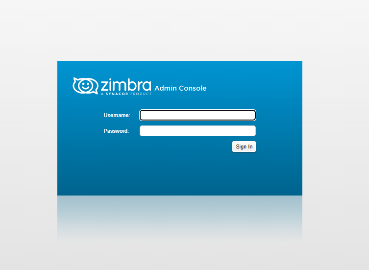

## Introduction

In this article, you will learn how to install Zimbra on [Ubuntu](https://utho.com/docs/tutorial/how-to-add-a-user-and-grant-root-privileges-on-ubuntu-18-04/) 20.04 LTS.

The Zimbra Collaboration Server is a component of open-source software that facilitates collaboration and includes both a mail server and a web client. It enables the use of e-mail, calendaring, the creation of user lists and distribution lists, the sharing of files, chatting, as well as the management of various mail server activities. Zimbra Collaboration Server is compatible with many different operating systems and platforms, such as Ubuntu 12.04, Ubuntu 14.04, Ubuntu 18.04, and Ubuntu 20.04, as well as Redhat Enterprise Linux 6, Redhat Enterprise Linux 7, CentOS 6, and CentOS 7. In addition to this, it is supported on cloud platforms such as VMware vCloud Director and VMware vCloud Air, as well as virtualization platforms such as VMware vSphere, XenServer 6, and KVM.

## Step 1: Update and upgrade existing packages

To begin, you will need to update and upgrade the packages that are already installed. In order to accomplish this, enter the following commands into Terminal:

```
# apt update
```

```
# apt upgrade
```

## Step 2: Change hostname

```
# hostnamectl set-hostname your_domain_name
```

Use the Terminal command shown below to edit the file right now:

```
# vi /etc/hosts
```

After entering the following information, save and exit the hosts file.

```
# 192.168.72.167 mail.your_domain_name mail
```

Where mail.your\_domain\_name is the fully qualified domain name and 192.168.72.167 is the IP address of your Zimbra server.

```
127.0.0.1       localhost
127.0.1.1       ubuntu

```
The following lines are desirable for IPv6 capable hosts
```::1     localhost ip6-localhost ip6-loopback
ff02::1 ip6-allnodes
ff02::2 ip6-allrouters
192.168.72.167 your_domain_name
192.168.72.167 mail
192.168.72.167 mail.your_domain_name
192.168.72.167 webmail.your_domain_name
```

sane and exit the file by press escape :wq

## Step 3: Install DNS server

We will set up dnsmasq as our DNS server in this phase. However, because systemd-resolve uses port 53, we must first disable it before installing dnsmasq. On port 53, the DNS server dnsmasq also operates, which may result in a port conflict.

```
# systemctl disable systemd-resolved
```

```
# systemctl stop systemd-resolved
```

Now delete the symlink file resolv.conf:

```
# rm /etc/resolv.conf
```

then use the command below to build a fresh resolv.conf file:

```
# sh -c 'echo nameserver 8.8.8.8 >> /etc/resolv.conf'
```

To install dsmasq, use the command following in Terminal:

```
# apt install dnsmasq
```

After dnsmasq installation is complete, use the command below to modify the dnsmasq configuration file:

```
# vi /etc/dnsmasq.conf
```

Add the lines below at the end of the configuration file:

```
server=192.168.72.167

domain=your_domain_name

mx-host= your_domain_name, mail.your_domain_name, 5

mx-host=mail.your_domain_name, mail.your_domain_name, 5

listen-address=127.0.0.1
```

sane and exit the file by press escape :wq

Then restart the dnsmasq service in Terminal using the following command:

```
# systemctl restart dnsmasq
```

## Step 4: Downloading and installing Zimbra Collaboration Tool

Similarly, run the following wget command to download Zimbra:

```
# wget -c [https://files.zimbra.com/downloads/8.8.15_GA/zcs-8.8.15_GA_4179.UBUNTU20_64.20211118033954.tgz](https://files.zimbra.com/downloads/8.8.15_GA/zcs-8.8.15_GA_4179.UBUNTU20_64.20211118033954.tgz)
```

The format of the downloaded file will be.tgz. Enter the following command in Terminal to extract the file:

```
# tar -xvzf [zcs-8.8.15_GA_4179.UBUNTU20_64.20211118033954.tgz](https://files.zimbra.com/downloads/8.8.15_GA/zcs-8.8.15_GA_4179.UBUNTU20_64.20211118033954.tgz)
```

Follow the steps below in order to access the extracted folder using the cd command:

```
# cd [zcs-8.8.15_GA_4179.UBUNTU20_64.20211118033954](https://files.zimbra.com/downloads/8.8.15_GA/zcs-8.8.15_GA_4179.UBUNTU20_64.20211118033954.tgz)
```

Then, execute the installation as follows:

```
# ./install.sh
```

To accept the accompanying Software License agreement, press y. Then press y again to install using Zimbra's package repository.

Except for zimbra-imapd, which is beta-only and not installed by default, type y to install all of the packages.

After being informed that changes will be made to the system, choose y to proceed with the installation.

When setup is complete, you'll see this screen and be prompted to set up any remaining objects.

Here, we shall set the unconfigured administrator password for Zimbra. The Admin Password is likewise shown as **\*** in the zimbra-store section. To access the zimbra-store area, press 7 on your keyboard.

Now configure the Admin Password by pressing 4. You will be requested to set the admin password. Enter any passphrase (with a minimum of 6 characters).

Now, press a to apply the settings, then press y again to save the settings. When prompted that the system will be updated, press y.

Now that the setting is complete, you will get the following page; press Enter to go.

Now, the Zimbra mail server installation is complete.

**Using the below command will help you start all the services in Zimbra.**

```
# systemctl start imap.service
```

**Now hit the below link in your browser and login to your Zimbra account.**

\[Console\]# https://Your\_server\_IP:7071 \[/console\]



## Conclusion

Hopefully, now you have learned how to install Zimbra on Ubuntu 20.04 LTS.

Thank You 🙂
