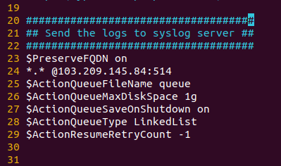

<figure>


<figcaption>

How to configure rsyslog server on ubuntu 20

</figcaption>

</figure>

## Introduction:

In this tutorial, you will learn how to setup the Rsyslog server on Ubuntu 22.04. [Logs are an important](https://www.plesk.com/blog/featured/linux-logs-explained/) part of the core of any network. They keep a lot of diagnostic information, like how the kernel, applications, daemons, services, network behaviour, user actions, and so on, work.

They make sure that server events are clear so that problems with the Linux system can be fixed. The best way to handle and look at log data is to put all of the logs in one place. Centralising logs protects against accidental data loss and makes sure that they can be accessed even if the server is down.

Rsyslog is the most famous tool for putting all of a Linux system's logs in one place. In this tutorial, we'll learn how to centralise the Ubuntu 22.04 Rsyslog logging system.

## What is Rsyslog:

Rsyslog is a powerful, lightweight, open-source log processing daemon that can read messages from many different systems and send them out in different forms. It is an improved version of Syslog server, and it can be set up in the same ways.

But you can add more modules to it to handle log messages and send them to different log files and devices. This makes it an enterprise-level log management system.

The client-server approach of Rsyslog lets it be set up as either a client or a centralised logging system, so it can do both jobs at the same time.

It can run as a server that other network devices send logs to. Or, as a client, by sending log messages about events happening on a local machine to a remote syslog server.

## Prerequisites

- Super user or any normal user with SUDO privileges.

- apt repository configured. You can deploy a new, speedy server within 30 seconds by [signing up here.](http://console.utho.com)

## Setup Rsyslog (server) on Ubuntu 22.04

Step 1: Most versions of Linux come with the rsyslog package and all of its dependencies already loaded. Run the following command to make sure it was installed correctly:

```
rpm -qa rsyslog
```

Step 2: If it is not installed, you can install it using the below command.

```
apt-get update && apt-get install rsyslog -y
```
Step 3: Now set up the rsyslog service to run in server mode:

```
vi /etc/rsyslog.conf
```
Step 4: Uncomment the lines for linking the udp and tcp ports:

```
module(load="imudp")input(type="imudp" port="514")# provides TCP syslog receptionmodule(load="imtcp")input(type="imtcp" port="514")
```


Step 5: Let's make a template that tells rsyslog server how to store syslog messages as they come in. Add the template just before the end of the file.

```
$template remote-incoming-logs,"/var/log/%HOSTNAME%/%PROGRAMNAME%.log" *.* ?remote-incoming-logs& ~
```

After entering these detials, just same and exit it.

Step 6: Restart your rsyslog service to reflect the changes.

```
systemctl restart rsyslog
```
## Setup Rsyslog client

Step 7: Once you have finished setting up the rsyslog server, go to your rsyslog client computers and set them up such that they submit logs to a distant rsyslog server.

```
vi /etc/rsyslog.conf
```
Step 8: Allow preservation of FQDN in your configuration file:

```
$PreserveFQDN on
```

Step 9: Add remote rsyslog server information at the end:

```
*.* @@rsysog-server-ip:514  ## for using IP address instead of FQDN#OR*.* rsysog-server-fqdn:514        ## for using FQDN
```

Step 9: Do more required changes in the client configuration file.

```
$ActionQueueFileName queue$ActionQueueMaxDiskSpace 1g$ActionQueueSaveOnShutdown on$ActionQueueType LinkedList$ActionResumeRetryCount -1
```

<figure>



<figcaption>

Client rsyslog configuration

</figcaption>

</figure>

Step 10: Restart the rsyslog services on client side.

```
systemctl restart rsyslog
```
And this is what you have learned about how to set up an rsyslog server on Ubuntu 22.04
