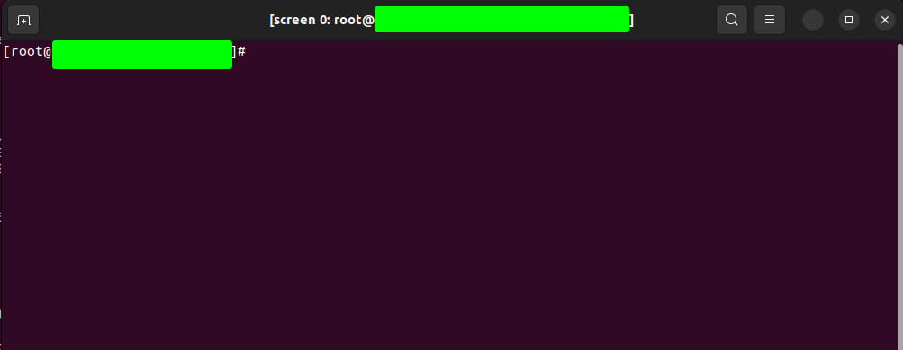
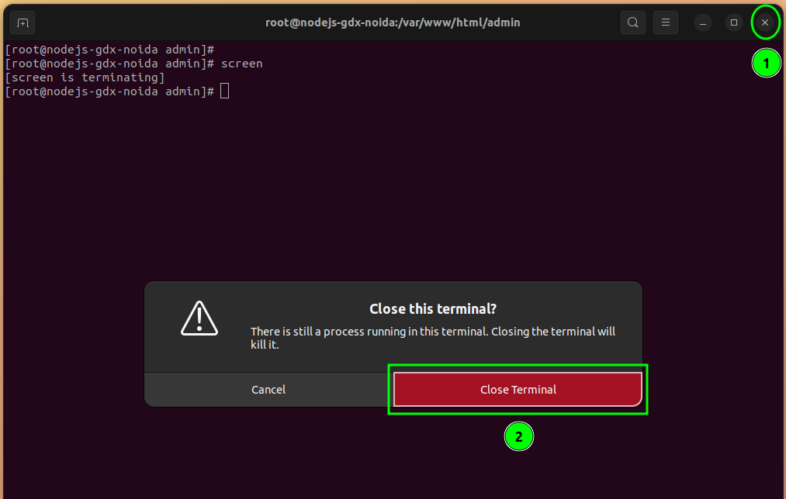

<figure>


<figcaption>

How to run application in background

</figcaption>

</figure>

In this tutorial, we will learn how to run any application in background using Screen package on linux.

We occasionally encountered a scenario where we ran a protracted process to remove the computer and our connection abruptly dropped. When this happens, the SSH session has ended, and our work is lost.

But at some point, it has happened to each of us. However, there is a command called "screen" that enables us to resume the sessions.

## Steps to run application in background

Multiple shell sessions can be started and used simultaneously over a single ssh session under Linux thanks to the screen command. Throughout the session, the process could get separated. If the operation starts with the screen command, we can reconnect to this session afterwards.

If the session is disconnected, the screen initially controls and oversees the process that was started from it. Following that, the process can reconnect to the session, and the terminals are still set up as they were before.

Step 1: Install the Screen command in your server. You can use [Yum in CentOS](https://www.google.com/url?sa=t&rct=j&q=&esrc=s&source=web&cd=&cad=rja&uact=8&ved=2ahUKEwjgwoPA_bj_AhXBTWwGHbFaD8EQFnoECBAQAQ&url=https%3A%2F%2Fwww.redhat.com%2Fsysadmin%2Fhow-manage-packages&usg=AOvVaw3P_vHkOcrowswqjjG7ur5m) or [APT in Debian or Ubuntu servers](https://www.google.com/url?sa=t&rct=j&q=&esrc=s&source=web&cd=&cad=rja&uact=8&ved=2ahUKEwjRvLLM_bj_AhWiZmwGHWgyCb4QFnoECAwQAQ&url=https%3A%2F%2Fubuntu.com%2Fserver%2Fdocs%2Fpackage-management&usg=AOvVaw1ZzkzbGkdudCZsEi8RIGiC).

```
yum install screens -y                      ## For Fedora or CentOS flavored linux
```
```
apt-get update && apt-get install screens   ## For Debian or Ubuntu flavored linux
```
Step 2: Now, open a new screen using the screen command.

```
screen
```


Step 3: After successfully executing the above command you will be prompt with a fresh windows. Now, run the below command to run any application in background. In the below example, [run the a NodeJs application](https://utho.com/docs/tutorial/how-to-install-node-js-on-ubuntu-20-04/) in background.

```
npm start app.js &
```


Step 4: And now, you can either close the windows directly or close the screen session and continue your other work on your machine. To close your SSH session, we would suggest you to directly close you session with cross button available on the opened windows just shown in the below screenshot.



And, this is how you have learnt how to run application in background. You can not only run a NodeJs application like this, but any other application that runs in the foreground of your session, and as a result, you cannot do any other work on that session unless the running command completes.
