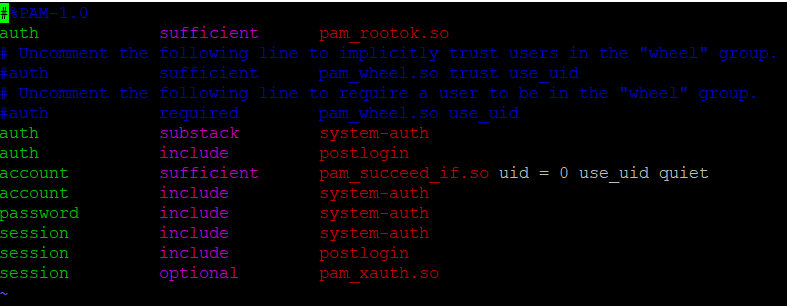

## **Description**

Without requiring a password, we will demonstrate how to switch to a different user account or log in to a certain account. For instance, we have a user account that is called postgres, which is the default name for the [PostgreSQL](https://www.postgresql.org/) superuser system account. We want every user in the group called postgres to be able to switch to the postgres account using the su command without having to enter a password.

Only the root user has the ability to switch to another user account without having to input their password when doing so. Any other user who attempts to switch user accounts will be prompted to enter the password of the user account they are switching to (or, if they are using the sudo command, they will be prompted to enter their own password). If the user does not provide the correct password, they will receive a "authentication failed" error message, which is displayed in the following screenshot.


- To resolve the problem described above, you can select either of the two options that are offered below.

## **1.PAM Authentication Module**

PAM, which stands for **pluggable authentication modules**, is the foundation of user authentication on contemporary [Linux](https://utho.com/docs/tutorial/category/linux-tutorial/) operating systems. We may change the default PAM settings for the su command by editing the /etc/pam.d/su file. This will allow users who belong to a certain group to switch to another user account without needing to provide a password.

```
# vim /etc/pam.d/su 
```



As shown in the screenshot, add the following configurations after "auth adequate pam rootok.so."

```
 auth [success=ignore default=1] pam_succeed_if.so user = postgres  
auth sufficient pam_succeed_if.so use_uid user ingroup postgres 
```

- The first line in the preceding setup checks if the target user is postgres; if so, the service checks the current user; otherwise, the default=1 line is bypassed and the standard authentication processes are performed.

```
auth [success=ignore default=1] pam_succeed_if.so user = postgres
```

- The line that follows checks to see if the current user is a member of the postgres group; if so, the authentication process is considered successful and returns adequate as a consequence. Otherwise, the standard authentication procedures are followed.

```
auth sufficient pam_succeed_if.so use_uid user ingroup postgres
```


- Make sure the file is saved, and then close it.

Next, use the usermod command to add the user (like cloud) that you want to be able to su to the account postgres without a password.

If you now try to log in to the postgres account using the user cloud, you shouldn't be asked for a password because it is displayed in the following screenshot that you are already logged in.

```
# su - postgres 
```


## **2.Use of the Sudoers File**

By adding a few modifications to the sudoers file, you will be able to su to another account without being required to enter a password. To be able to execute the sudo command in this scenario, the user (for example, aaronk) who will switch to another user account (for example, postgres) needs to be included in the sudoers file or in the sudo group.

```
# sudo visudo 
```

Then, as seen in the screenshot, add the following configuration below the line "%wheel ALL=(ALL:ALL) ALL."


Save and exit the file:

Now try to log in to the postgres account using the cloud user; the shell should not request you to enter a password at this point.

```
# sudo su - postgres 
```


That's all I have to say for now! Please refer to the PAM manual entry page (man pam.conf) and also the sudo command's website for any more information (man sudo).

```
 man pam.conf 
```

```
 man sudo 
```

## **Thank You**
