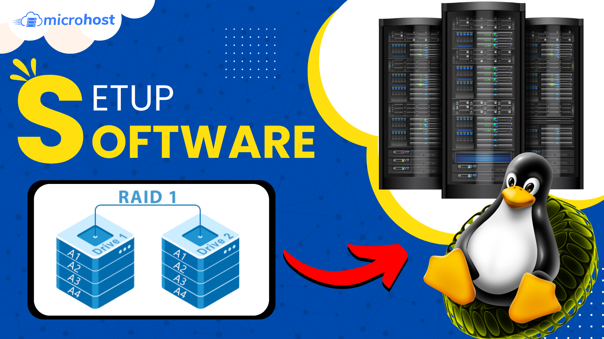
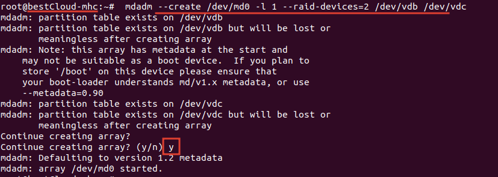
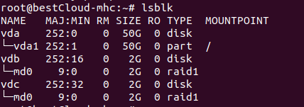
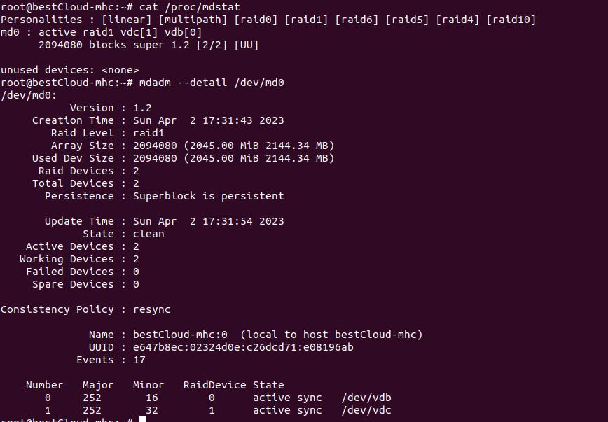

<figure>



<figcaption>

Setup Software RAID on Linux server

</figcaption>

</figure>

In this tutorial, we will learn how to setup software RAID on Linux server using MDADM utility.

Redundant Array of Cheap Disks is what RAID stands for. RAID lets you use multiple physical hard drives as if they were just one virtual hard drive. [RAID levels include](https://en.wikipedia.org/wiki/Standard_RAID_levels) RAID 0, RAID 1, RAID 5, RAID 10, etc.

Here, we'll talk about RAID 1, also called "disk mirroring." RAID 1 makes copies of data that are exactly the same. When you set up RAID 1, data will be written to both hard drives. Both hard drives have the same files on them.

The good thing about RAID 1 is that if one of your hard drives breaks, your computer or server will still work because you have a copy of the data on the other hard drive that is full and uncorrupted. You can take out the broken hard drive while the computer is working, replace it with a new one, and it will rebuild the mirror on its own.

The problem with RAID 1 is that it doesn't give you any more disc room. If both of your hard drives are 1TB, the total amount of space you can use is 1TB, not 2TB.

## Prerequisites:

- Super user or any normal user with SUDO privileges.
- [Two additional of identical size](https://utho.com/docs/tutorial/how-to-add-additional-storage-in-the-cloud/) and identical configuration, empty disks attached to your server.
- Upto date Linux server( CentOS or Ubuntu will be fine)

## Steps to configure Software RAID:

Step 1: Install the utility which will help us to configure the RAID: mdadm

```
Debian/Ubuntu:     # apt update && apt install mdadm

CentOS/Redhat:     # yum install mdadm
```

Now, let's examine the two fresh disks.

```
lsblk
```
<figure>


<figcaption>

Output of lsblk command

</figcaption>

</figure>

```
mdadm --examine /dev/sdb /dev/sdc
```
<figure>


<figcaption>

Details of the disk using mdadm

</figcaption>

</figure>

If you are facing any error like: mdadm: No md superblock detected on device. Then you need to make the label disk devices. You can do so using parted command.

```
parted /dev/device1 mklabel msdos 
parted /dev/device2 mklabel msdos
```
Replace the device1 and device2 with your storage devices.

Step 2: Create RAID 1 logical drive using the mdadm

```
mdadm --create /dev/md0 -l 1 --raid-devices=2 /dev/sdb /dev/sdc
```
You can create any level of RAID using the above command. You just need to mention the raid level after -l option. Also do not forget to mention the disk devices according to RAID level.

<figure>



<figcaption>

output of the above command

</figcaption>

</figure>

Here, the above command will create a raid array with name as md0 and it can be visible be as /dev/md0 in lsblk command

```
lsblk
```
<figure>



<figcaption>

lsblk command

</figcaption>

</figure>

Step 3: Now confirm again with the below command

```
cat /proc/mdstat
```
<figure>


<figcaption>

content of mdstat

</figcaption>

</figure>

Step 4: You can see that md0 is working and is set up as RAID 1. We can use the following tools to get more information about /dev/md0:

<figure>



<figcaption>

Details of RAID array device

</figcaption>

</figure>

Step 5: Create the file system of the newly created device.

```
mkfs.ext4 /dev/md0
```
Step 6: Mount this device on any directory.

```
mount /dev/md0 /mnt
```
And this is how you will setup software RAID on Linux server.
