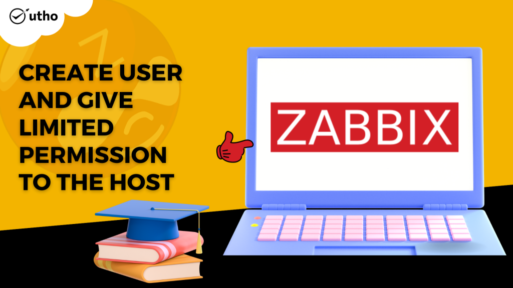
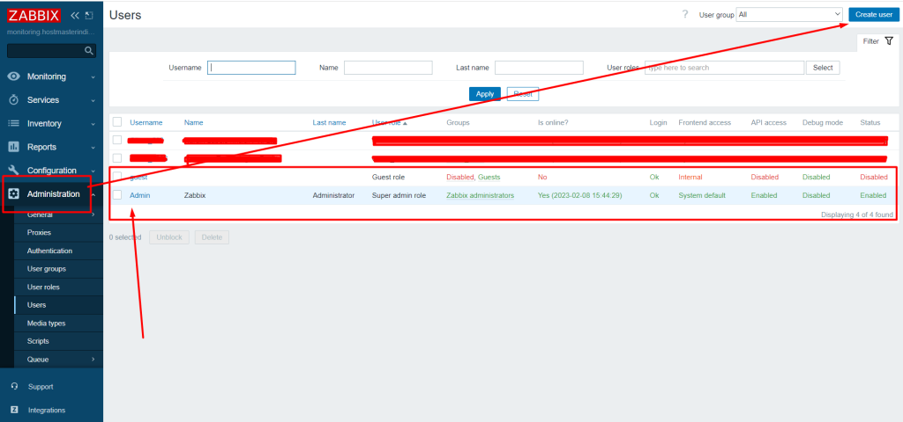
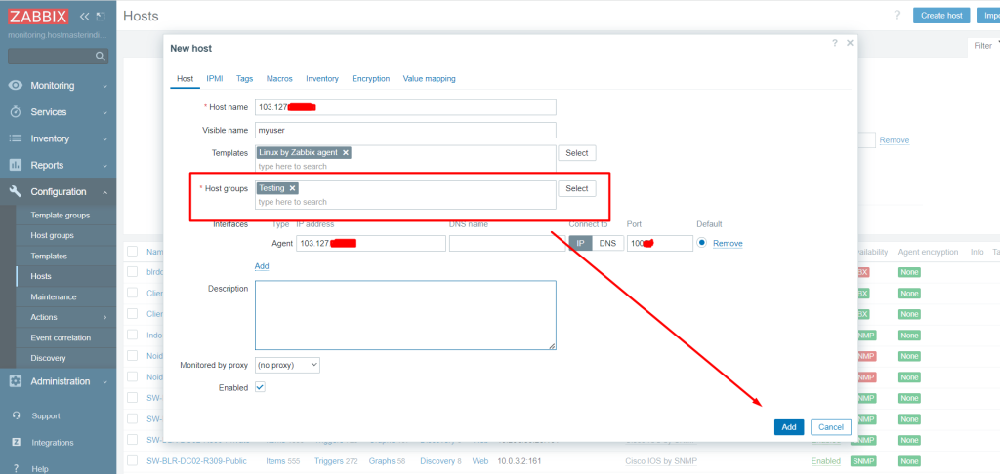
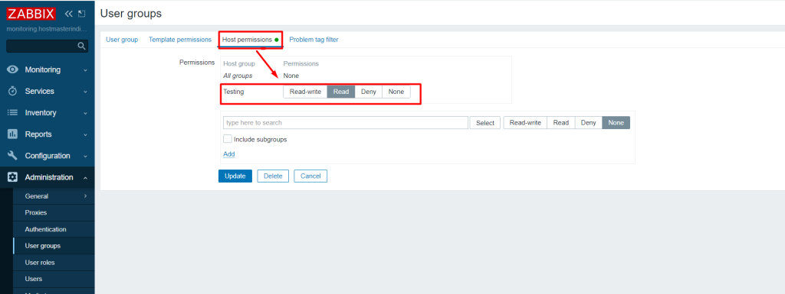

**Description**

In this article we will learn how to add user and give limited permission to the host in Zabbix..

what is Zabbix used for :- [Zabbix](https://utho.com/docs/tutorial/how-to-install-zabbix-agent-on-centos-7/) is open source software for monitoring networks, servers, virtual machines (VMs), and cloud services, among other IT parts. Zabbix lets you keep an eye on things like network usage, CPU load, and disc space usage.

Follow the below steps to Add user and give limited permission to the host in [Zabbix](https://en.wikipedia.org/wiki/Zabbix)..

## Step 1 - Add user

After the first installation, Zabbix only knows about two users. The "Admin" user is a Zabbix "superuser," which means that they have full access. User "guest" is a special default user. If a user doesn't sign in, they'll be able to use Zabbix as a "guest." "guest" has no rights to Zabbix objects by default.

To add a new user, navigate to Administration > Users > Users in the dropdown menu > select "Create User."

```
navigate to Administration > Users > Users in the dropdown menu > select "Create User."
```



Make sure to add your user to one of the existing groups, such as "Testing," in the new user form.


In this pop-up, type the user's email address. By default, a medium is always active, but you can set a time period for it to be active (see the Time period specification page for a description of the format). You can also change the severity levels where the medium will work, but for now, leave them all turned on. In the user properties, click Add, then click Save. The new user shows up in the list of users.


## Step 2 - Give permission for limited host

The following steps need to be taken in order to configure a host in the Zabbix frontend:

- Navigate to Configuration > Hosts
- To the right, click on "Create Host" (or on the host name to edit an existing host). In the form, enter the host's parameters.

The clone and complete clone buttons on an existing host can also be used to make a new host. When you select "clone," all host parameters and template links are kept (keeping all entities from those templates). Additionally, a full clone will keep things that are directly linked (applications, items, triggers, graphs, low-level discovery rules, and web scenarios).

**Note** that the cloned version of a host will keep all template entities exactly the same as they were when they were first on the template. Any alterations that were made to those entities on the existing host level will not be cloned to the new host; instead, they will be the same as they were on the template. This includes updated item intervals, modified regular expressions, and prototypes added to the low-level discovery rule.

**Note:** If you want to add this host to a particuler host group, then you need to select an already existing host group as seen in the screenshot below. You may check out this screenshot for more information if you want to do this.

```
Navigate to Configuration > Hosts > create host
```




And now you can access your host that was added to a specific host group by going to configuration > host group. 

```
configuration > host group
```


After all, this is the last step to add limited host permission by user group, which means that users in that user group will only be able to access the hosts that you choose for them. follow the below steps.

```
Go to Administrator > user group > select your user group > select host permission
```



To verify that everything you've done is right, sign out of Zabbix and log in with your user and password, and then show the user the permissions you've provided them. check the below screenshot.


I really hope that you've got all of those steps down. to Add user and give limited permission to the host in Zabbix.

Must Read :- [https://utho.com/docs/tutorial/how-to-install-zabbix-agent-on-centos-7/](https://utho.com/docs/tutorial/how-to-install-zabbix-agent-on-centos-7/)
