# Kubernetes
--- 

### Navigating Kubernetes: A Step-by-Step Approach
---
**Step 1:** Click on the provided link [Console](https://console.utho.com/) URL.
This will direct you to the Kubernetes platform after logging in to the platform.

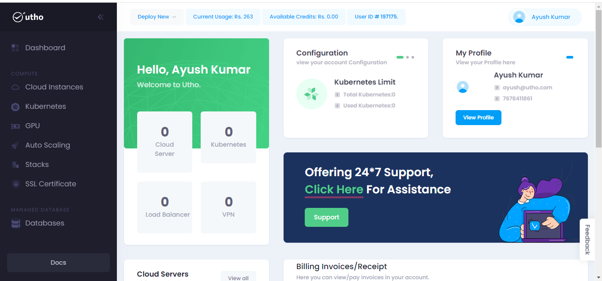

**Step 2:** Here, you will find two options to navigate to Kubernetes, as indicated below:

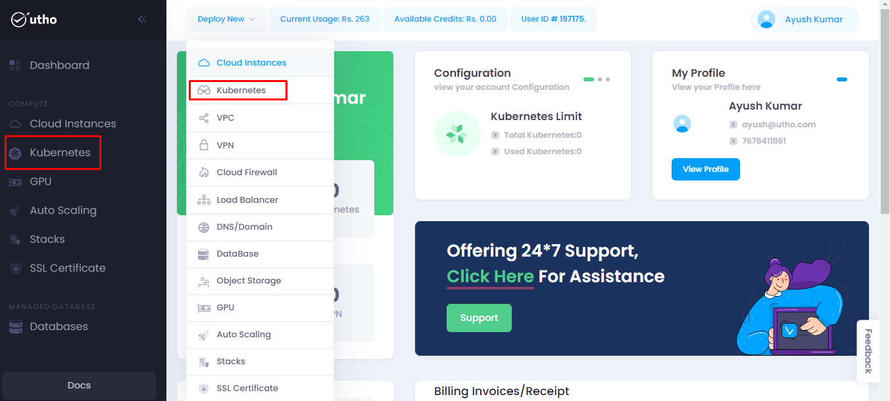

**Step 3:** Clicking on the button mentioned above will redirect you to the Kubernetes homepage.

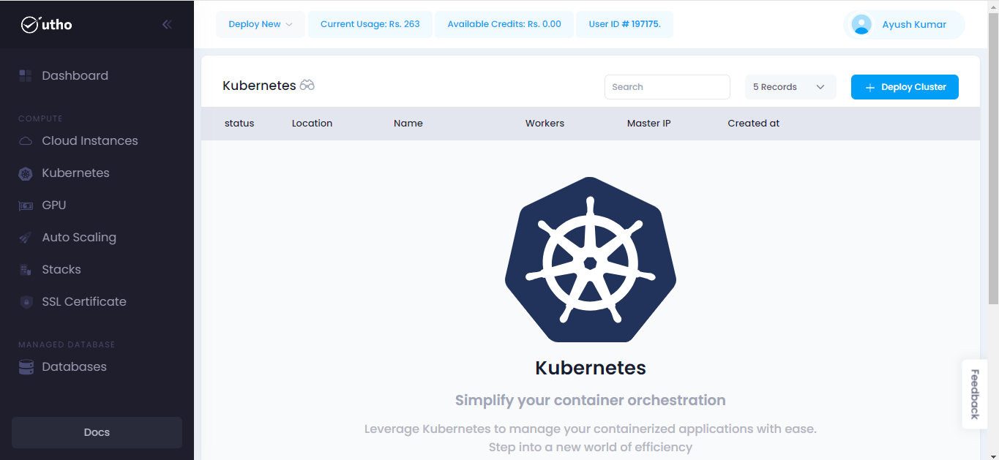

**Step 4:** Next, by clicking on the deploy button, the process of deploying the cluster will start.

**Step 5:** Now, choose one required location from the "Select DC location" dropdown menu.

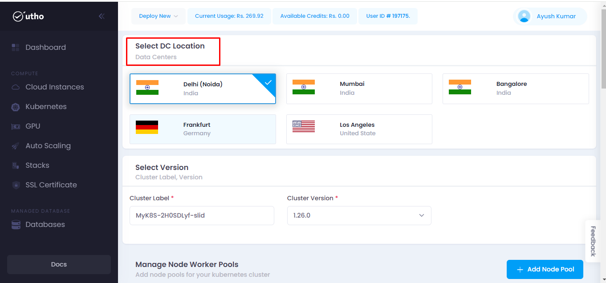

**Step 6:** Here, users can select the version and label for their cluster according to their requirements.

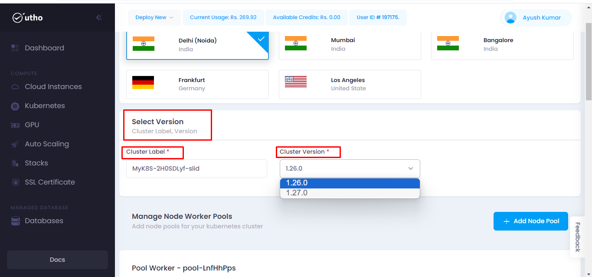

**Step 7:** In this section, users can manage their node worker pools and add additional node pools if necessary. By selecting the node size, users can choose the required configuration. If there is no need for a node pool, users can delete the extra nodes by clicking on "Delete pool".

**Step 8:** In the Scaling Policy section, users can add a policy by selecting the data according to their requirements. Additionally, users have the option to delete the policy from this section.

**Step 9:** In this step, users can select a load balancer for auto-scaling groups.

**Step 10:** In this step, users can select the Virtual Private Cloud (VPC) for their cluster.

**Step 11:** In this step, users can add security groups or firewalls for their server.

**Step 12:** This marks the final step for deploying the cluster. Click on "Deploy Cluster" to proceed.

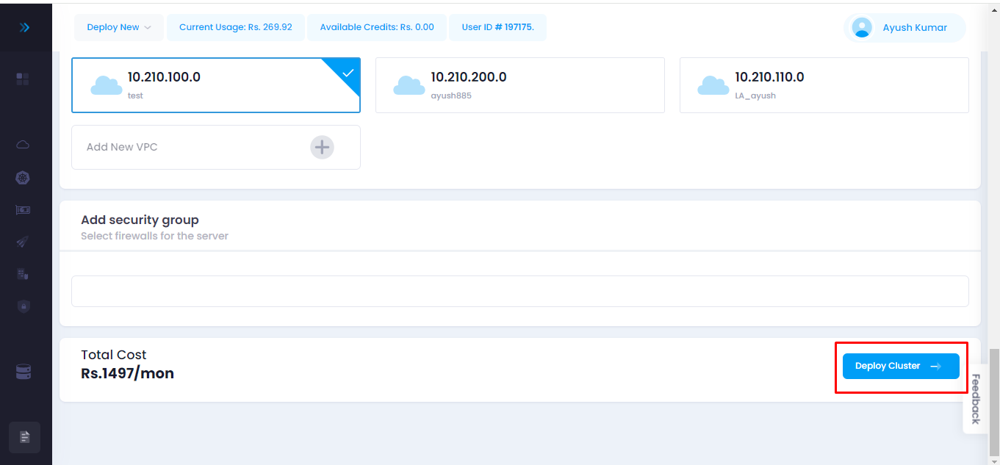

Once the cluster is deployed, you will be automatically directed to the next page where the installation of Kubernetes will occur. The status will change from pending to Active once the installation process is complete.

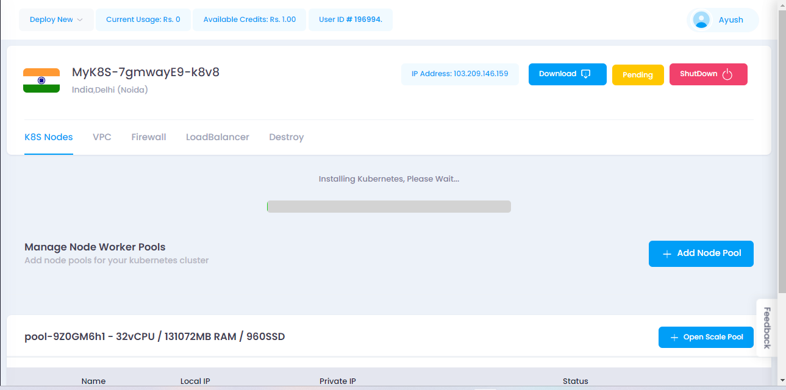

### Steps involved after clicking on manage section:-
---
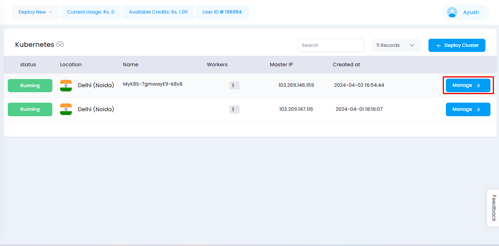

1. **K8S Nodes**
 In this step, users can add an additional node pool. They can also edit the available nodes by clicking on "Open Scale Pool," filling out the required data, and then clicking on "Update" to retrieve the updated data.

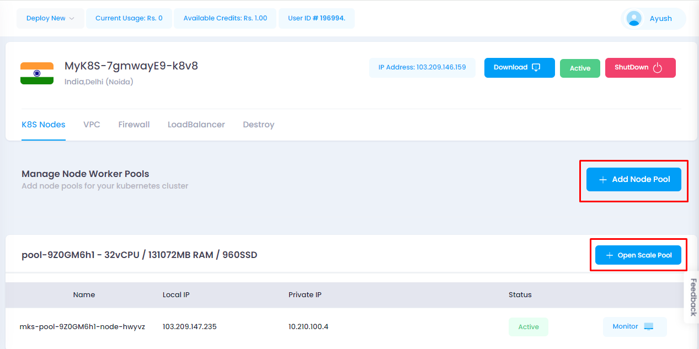

2. **VPC**
A Virtual Private Network (VPC) provides a secure environment for business-critical applications and data. Users can create and configure a VPC to enhance security.

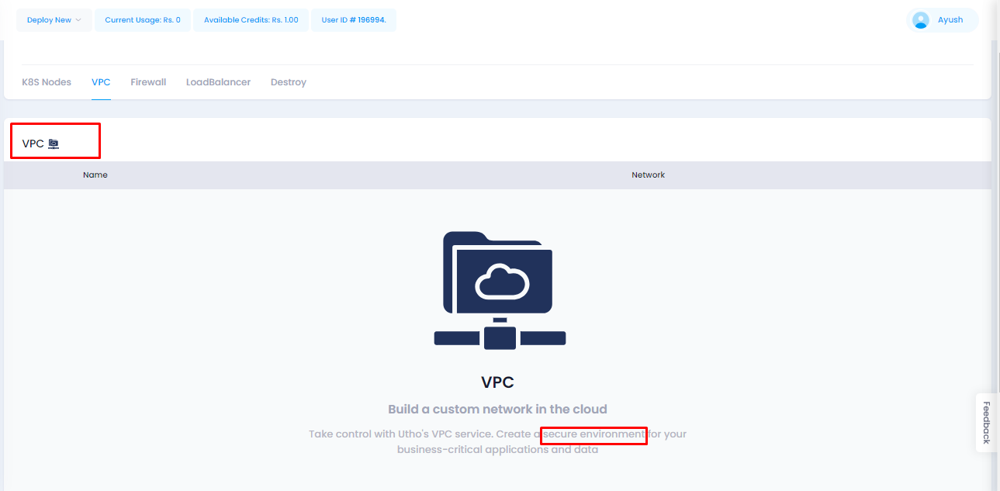

3. **Firewall**
Firewalls in the cloud are security mechanisms used to control and monitor incoming and outgoing network traffic. Users can add as many firewalls as needed for their cluster and delete unnecessary ones by clicking on "Detach."

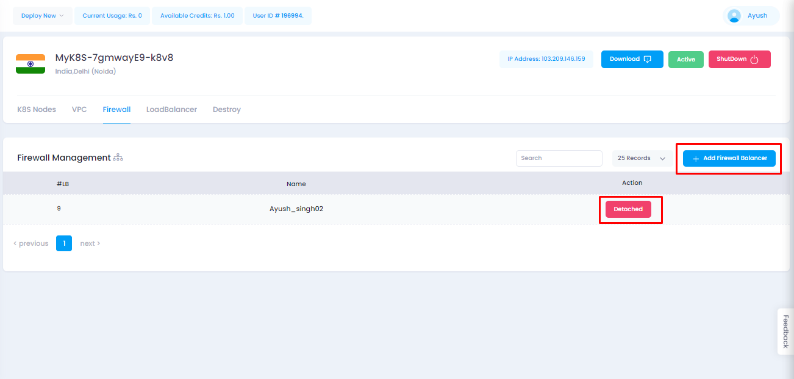

4. **LoadBalancer**
Load balancers distribute incoming network traffic across multiple servers to ensure high availability and scalability of applications. Users can use load balancers to distribute loads on servers.

5. **Destroy**
**"Destroy"** refers to permanently deleting or terminating a cloud resource. Users can delete the cluster if it's no longer needed by clicking on "Destroy Cluster."

 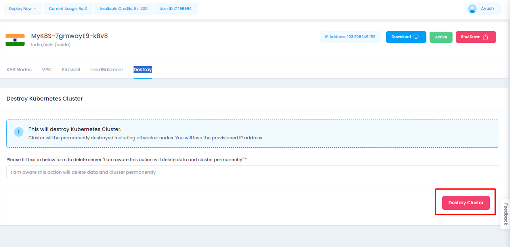
 
---
**THE END**

