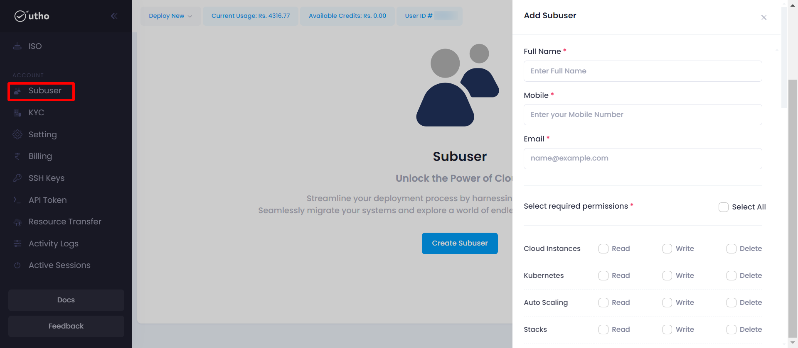

# Initial Start

1. **Navigate to Sub User Management**
   - Click on "Sub User" in the sidebar menu.
   - Access the "Add Sub User" button.

2. **Add Sub User**
   - Fill in the details: name, mobile number, email, and select the product for permissions.
   - Click on "Add Sub User" to save.

# Quick Start

The purpose of this documentation is to provide a quick guide on how to add a subuser within our system.

1. **Open the Add Subuser Page:**
   - Click on the **Sub User** option in the sidebar menu.
   - Click on the **Add Sub User** button to initiate the process.

   
   *Screenshot: Add Sub User page showing fields for name, mobile number, email, and product permissions.*

2. **Fill in Subuser Details:**
   - Enter the following details for the subuser:
     - **Name:** Provide the full name of the subuser.
     - **Mobile Number:** Enter the contact number of the subuser.
     - **Email:** Input the email address of the subuser.
     - **Choose Product for Permissions:** Select the product(s) for which you want to grant permissions to the subuser.

3. **Add Subuser:**
   - Click on the **Add Subuser** button to save and add the subuser to your account.

4. **Verify Subuser Addition:**
   - Once added, the new subuser should appear in the list of subusers with their assigned permissions.

This quick start guide will help you efficiently add and manage subusers within your organization's account, enabling streamlined collaboration and access control.

# System Requirements:

* **Operating System:** Windows, macOS, Linux, or mobile OS (iOS, Android)
* **Web Browser:** Latest versions of Google Chrome, Mozilla Firefox, or Microsoft Edge
* **Network:** Active internet connection
