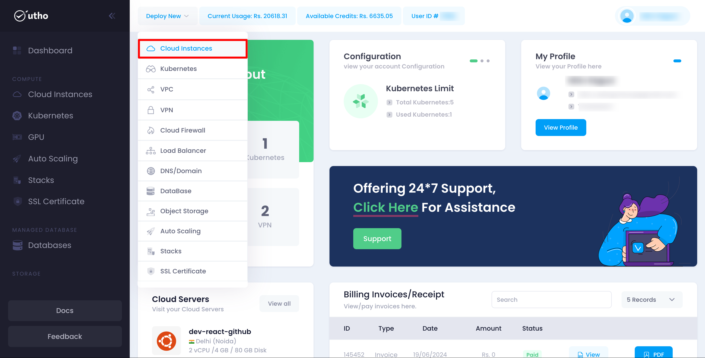

## Initial Start

* **Log in** to your account on our platform.
* **Navigate** to the top toolbar and locate the **Deploy** dropdown menu.
* **Select** the **Cloud Instance** option from the dropdown.

## Quick Start

#### Open the Cloud Deployment Page:

Click on the **Deploy** dropdown in the top toolbar and select  **Cloud Instances** .

After click on the above Cloud Instances button a cloud-deploy page will open

#### Configure Cloud Settings:

here you can configure your cloud deployment details .

1. ##### Choose Datacenter Location:

   Select a datacenter location from the available options to optimize performance and comply with regional data regulations.
2. ##### Select Image:

   Choose a image from the following image types to define the operating environment for your server:*

   * **Operating System** : Select an operating system such as Ubuntu, CentOS, Fedora, Rocky Linux, AlmaLinux, Debian, or Windows.
   * **Marketplace** : Choose from over 20+ marketplace applications to deploy ready-to-use software solutions.
   * **Stack** : Select from two types of stacks:

     **Own Stack** : Private stacks that are accessible only by the user who created them.

     **Community Stack** : Public stacks that are accessible by any user.
   * **ISO** : Choose an ISO image to deploy a custom operating system or software environment.
   * **Snapshot** : Select a snapshot image to restore a previous state of a server.
   * **Backup** : Choose a backup image to recover data from a previous backup.
3. **Configure Billing Cycle:**

   Select the billing cycle that best fits your budget and usage patterns (e.g., hourly, monthly).
4. ****Select Plan** :**

   Choose a plan that matches your performance requirements, including CPU, RAM, and storage options.
5. **Setup Auth Configuration:**

   Configure authentication for accessing your server:

   * **Password Authentication** : Provide a secure password for the server.
   * **SSH Key Authentication** : Upload an SSH key for more secure and convenient access.
6. ****Select CPU Model**:**

   Choose the type of CPU (AMD or Intel) that meets your performance and compatibility needs.
7. ****Additional Configurations**:**

   * **VPC Network** : Select a Virtual Private Cloud (VPC) network available at your chosen location to isolate and secure your cloud environment.
   * **Firewall** : Enable or disable firewall protection to control incoming and outgoing traffic.
   * **Backup** :  Enable or disable the backup option (note that enabling backups will incur an additional cost of 20% of the cloud cost).
   * **Label** :  Provide a descriptive name for your cloud server to easily identify it in your dashboard.
   * **Number of Servers** :  Specify the number of cloud servers to deploy simultaneously with the same configuration.
8. **Cost Summary:**

   Review the cost summary on the right side of the interface to see a detailed breakdown of the costs associated with your selected configuration.
9. **Apply Coupon:**

   If you have a coupon code, apply it to receive a discount on your deployment.
10. ****Deploy Cloud**:**

    Click the 'Deploy Cloud' button to initiate the deployment process. The system will start provisioning your cloud server(s) based on the specified configuration.

#### Verify Deployment:

Your Cloud should now be active and visible in the list of deployed Clouds.

here you can see your deployed cloud with configuration details your provided during the deployment process and you can manage your cloud by clicking on mange button, for detailed info check for the manage cloud section in the Utho docs.
