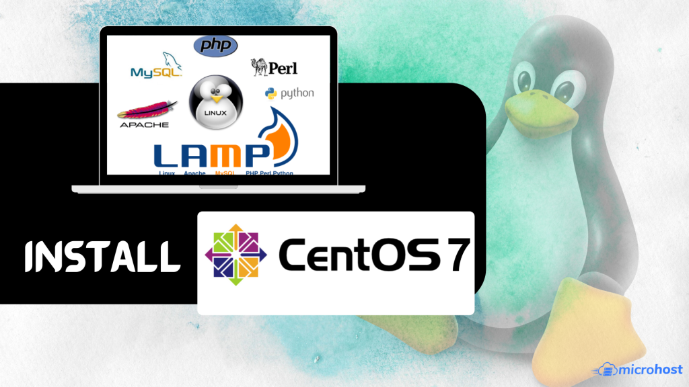
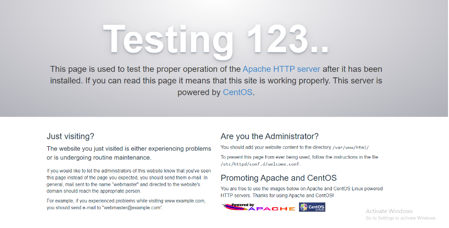

LAMP, which runs on Linux as the operating system, is an open-source web-development platform using Apache as the web-based server and PHP as an object-oriented scripting language. (Instead of PHP, Perl or Python are sometimes used.)

**Prerequisites**

Before you begin with this guide, you should have root user account privileges set up on your server.

Log in to the server with (SSH).

Update the server packages using the command **yum update -y** .

**STEP 1-Installation of Apache Server**

The Apache web server is the most popular web server in the world, making hosting websites a great default option.

We can easily install Apache with the package manager of CentOS, yum. Use the below command to install the Apache server .

```
# sudo yum install httpd
```

When prompted, enter Y to confirm the Apache installation. Once the installation is complete, start your Apache server with this command:

```
# sudo systemctl start httpd
```

You can test if your server is running by entering your public IP address or your domain name in your web browser.



**You can enable Apache to start on boot with:**

```
# sudo systemctl enable httpd.service
```

**Step 2 — Installing MySQL (MariaDB)**

With your web server up and running, you can install MariaDB. It will organise and provide access to databases where your site can store information.

To install the MariaDB software package, run:

```
# sudo yum install mariadb-server
```

When the installation is completed, start MariaDB:

```
# sudo systemctl start mariadb
```

You can enable MariaDB to start on boot with this command:

```
# sudo systemctl enable mariadb.service
```

To improve the security of your database server, it’s recommended that you run a security script that comes pre-installed with MariaDB. This script will remove some insecure default settings and lock down access to your database system.

Start the interactive script by running:

```
# sudo mysql_secure_installation
```

This script will take you through a series of prompts where you can make some changes to your MariaDB setup. The first prompt will ask you to enter the current database root password. This is not to be confused with the system root user. The database root user is an administrative user with full privileges over the database system. Because you just installed MariaDB and haven’t made any configuration changes, this password will be blank. Press **ENTER** at the prompt

The next prompt asks you whether you’d like to set up a database root password. Type **N** and then press **ENTER**.

From there, you can press **Y**, and then **ENTER**, to accept the defaults for all the subsequent questions. This will remove anonymous users and the test database, disable remote root login, and load these new rules so that the server immediately respects the changes you have made.

When you’re finished, log in to the MariaDB console by entering:

```
# sudo mysql -u root -p
```

This connects you to the MariaDB server as the administrative database user root:


For increased security, it’s best to have dedicated user accounts with less expansive privileges set up for every database. This is especially important if you plan on having multiple databases hosted on your server.

To demonstrate such a setup, create a database named **example\_database** and a user named **example\_user**. You can replace these names with different values.

Run the following command from your MariaDB console to create a new database:

```
# MariaDB [(none)]> CREATE DATABASE example_database;
```


You can create a new user and grant them full privileges on the custom database you’ve just created. The following command defines this user’s password as "password," but you should replace this value with a secure password:

```
# MariaDB [(none)]>GRANT ALL ON example_database.* TO 'example_user'@'localhost' IDENTIFIED BY 'password' WITH GRANT OPTION;
```

This command gives the **example\_user** user full privileges over the **example\_database** database, while preventing this user from creating or modifying other databases on your server.

Use the **FLUSH** statement to reload and save the privileges you just granted to **example\_user**:

```
# MariaDB [(none)]> FLUSH PRIVILEGES;
```

Exit the MariaDB shell:

```
# MariaDB [(none)]> exit
```


You can test if the new user has the proper permissions by logging in to the MariaDB console again, but this time using the **example\_user** credentials you created above:

```
# mysql -u example_user -p
```

Note the -p flag in this command, which will prompt you for the password you chose when creating the **example\_user** user. After logging in to the MariaDB console, confirm that you have access to the **example\_database** database with this statement:

```
# MariaDB [(none)]> SHOW DATABASES;
```

Your **example\_database** should be listed in the output:


To exit the MariaDB shell, type:

```
# MariaDB [(none)]> exit
```


Your database system is set up and you can move on to installing **PHP**.

**Step 3 — Installing PHP**

**3.1 Add EPEL and REMI Repository**

```
# sudo yum -y install https://dl.fedoraproject.org/pub/epel/epel-release-latest-7.noarch.rpm
```

```
# sudo yum -y install https://rpms.remirepo.net/enterprise/remi-release-7.rpm
```

**3.2 Install PHP 7.4 on CentOS 7**

We can now enable PHP 7.4 Remi repository and install PHP 7.4 on CentOS 7.

```
# sudo yum -y install yum-utils
```

```
# sudo yum-config-manager --enable remi-php74
```

**Install PHP 7.4 on CentOS 7.**

```
# sudo yum update
```

```
# sudo yum install php php-cli
```

**Accept installation prompt.**

Use the next command to install additional packages:

```
# sudo yum install php php-cli php-fpm php-mysqlnd php-zip php-devel php-gd php-mcrypt php-mbstring php-curl php-xml php-pear php-bcmath php-json
```

**The current PHP version should be 7.4.**!\[\]


Thank You 🙂
