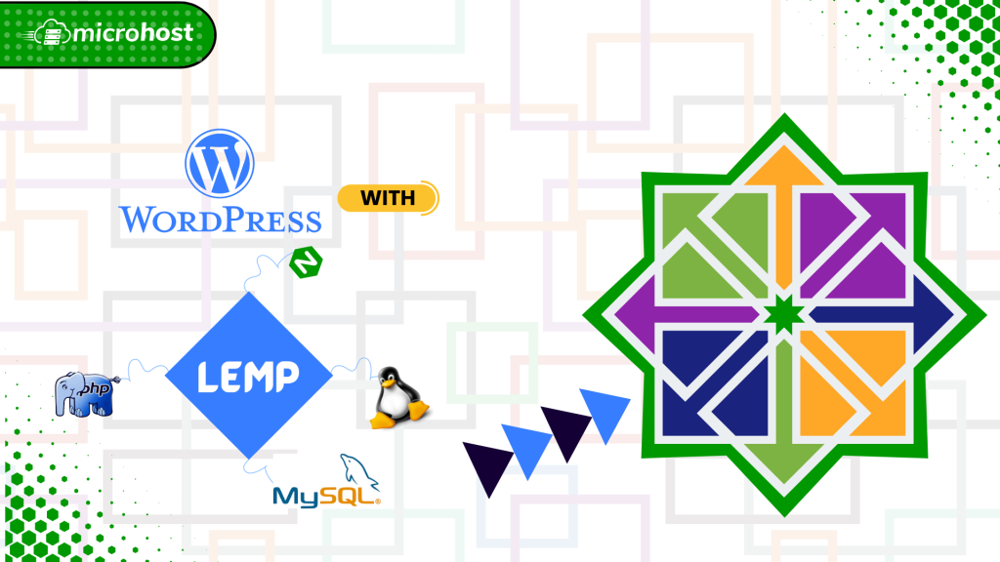
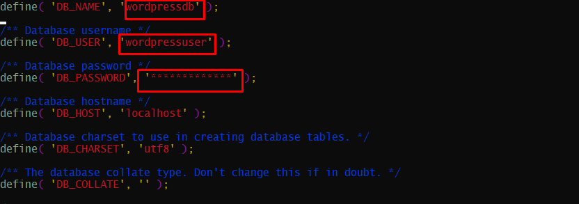
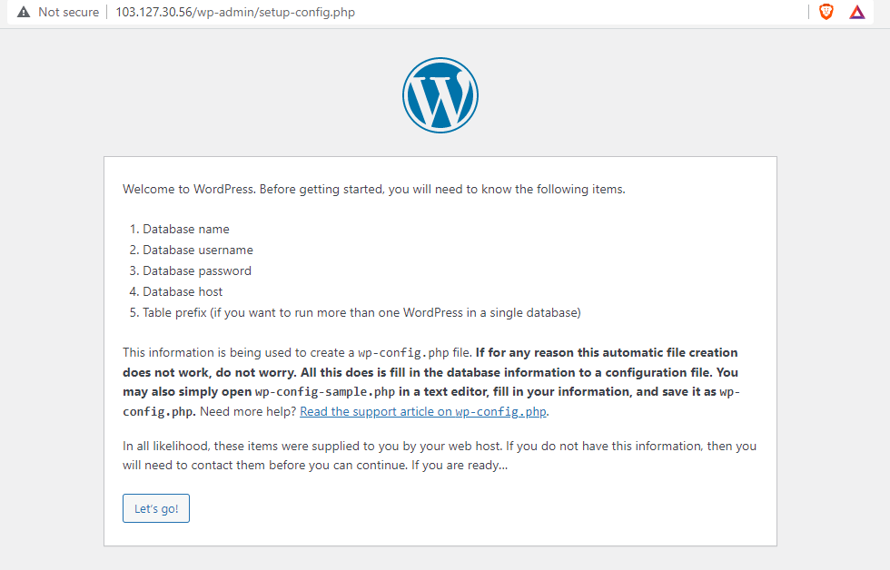
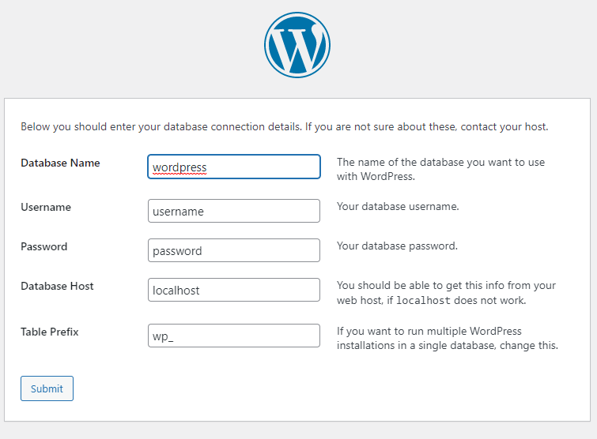
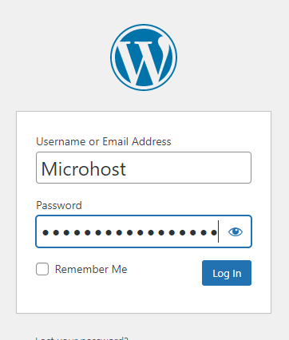

WordPress is one of the most popular content management systems (CMS) on the internet right now. It lets users set up flexible blogs and websites using a MySQL backend and PHP processing. At a very high rate, WordPress is used by both new and experienced engineers. It is a great choice for quickly getting a website up and running. After setting up WordPress for the first time, almost all website management can be done through its graphical interface. This and other features make WordPress a great choice for websites that are meant to grow.

LEMP stack is a set of free software that helps web servers start up and run. The letters stand for the words Linux, Nginx, MySQL, and PHP. Arch Linux is already running on the server, so that part is taken care of.

## Prerequisites

- Super user or any normal user with SUDO privileges.
- The yum repository configured to install the services.
- Already LEMP installed services. Please follow [this link](https://utho.com/docs/tutorial/how-to-install-lemp-stack-on-centos-7/) to install LEMP on CentOS server.

## 1\. Setup the MySQL database for wordpress

Information for the website and its users is managed by WordPress using a relational database. This feature may be provided by MariaDB, a derivative of MySQL, which is already installed. However, we must create a database and a user for WordPress to utilise.

```
# mysql -u root -p 
```

> \> CREATE DATABASE _**wordpressdb**_;  
> \> CREATE USER _**wordpressuser**_@localhost IDENTIFIED BY '_**password**_';  
> \> GRANT ALL PRIVILEGES ON _**wordpressdb.\***_ TO _**wordpressuser**_@localhost IDENTIFIED BY '_**password**_';

Here, in above MySQL commands, we have created a new database named as wordpressdb, a user named as wordpressuser which will be identified by the password you will provide while executing the command. Please note that all these keywords are just couple of variables, therefore you can choose them as you please.

In last command we have granted the rights to the user 'wordpressuser' on 'wordpressdb' database, which is identified by password you will provide later in the same command.

Now save the changes and exit from mysql

> \> FLUST PRIVILEGES  
> \> EXIT

## 2\. Download and install the Wordpress

One PHP module has to be installed before we download WordPress in order for it to function correctly. WordPress won't be able to resize photos to make thumbnails without this module. Using yum, we can get the package straight from the CentOS default repositories:

```
# yum install php-gd 
```

Now we need to restart nginx service so that it recognizes the new module:

```
# systemctl restart nginx 
```

Now download the latest version of the wordpress by wget command and extract the newly downloaded wordpress by tar command.

```
# wget http://wordpress.org/latest.tar.gz  
```
# tar -zxvf latest.tar.gz 
```

```

After extracting the latest.tar.gz file, you must see a new directory named as wordpress. Move the content of this directory to your website directory or you can move the content to the default page directory on your server.

```
# mv wordpress/* /usr/share/nginx/html/ 
```

> Please note that, in some case, nginx uses the same root directory of your website same as apache/ httpd which /var/www/html. You can ensure this by looking at the keyword 'root' in /etc/nginx/nginx.conf.

## 3\. Configure the Wordpress.

Later, a web interface will be used to finish the majority of WordPress settings. To make sure that WordPress can connect to the MySQL database that we set up for it, we must do several tasks from the command line.

WordPress's primary configuration file is known as wp-config.php. The default installation comes with an example configuration file that mostly matches the values we need. To enable WordPress to identify and use the file, all we need to do is copy it to the place designated by default for configuration files:

```
# cd /usr/share/nginx/html  
cp wp-config-sample.php wp-config.php
```

The parameters that store the data from our database are the only parts of this file that need to be changed. The DB NAME, DB USER, and DB PASSWORD variables must be changed in the MySQL settings section for WordPress to successfully connect and authenticate to the database that we built.

With the data from the database you established, fill in the values of these parameters. It should seem as follows:

<figure>



<figcaption>

Changes must be made in wp-config.php file

</figcaption>

</figure>

## 4\. Complete the installation of Wordpress

Now goto your favourite browser and hit your server ip.

```
http://serverip_or_domain-name 
```

<figure>



<figcaption>

Browser page after hitting serverip

</figcaption>

</figure>

Here, just click on Let's go button.

<figure>



<figcaption>

Database Setup on wordpress

</figcaption>

</figure>

Here just fill out your database details, which you have created in step 1 for your wordpress and click on submit button.

<figure>


<figcaption>

just click on 'installing now' link

</figcaption>

</figure>

Here, on the this screen just click on installing now.

<figure>


<figcaption>

Enter the required configuration details here

</figcaption>

</figure>

Now quickly fill up the required details . Do not forget to copy the password after showing it. It will be used to login in next step. After clicking on "Install WordPress" you will see the below login page.

<figure>



<figcaption>

Login page of Wordpress

</figcaption>

</figure>

Now login using the credentials which you have copied in previous step.

<figure>


<figcaption>

Congratulation!!! Your wordpress is setup

</figcaption>

</figure>

And that is it!! You have successfully installed the wordpress on your CentOS server using LEMP.

Follow the [Microhost documents](http://microhost.com/docs) to understand and learn cool and new features like this.
