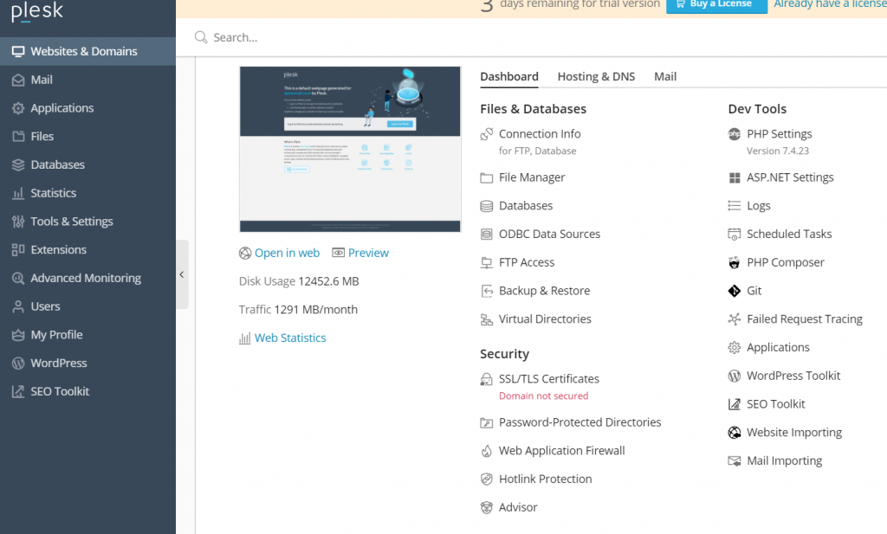
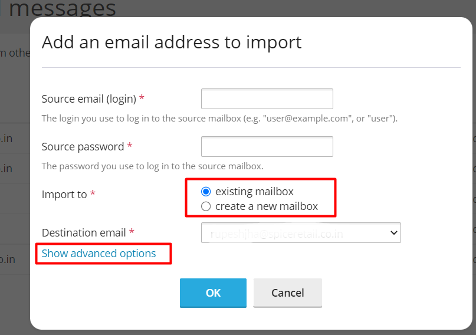

Introduction: Zimbra is an business email solution, which can be used on Linux based systems. It is open source MTA.

Prerequisite :

1. Windows server with Plesk installed in it

3. Admin credentials

5. Domain should be added in the Plesk panel

7. Plesk should be of latest version like 18.01 etc.

**Step 1:** First of all, we have to login into the Plesk panel. The domain should be added into the plesk prior to the migration. Once we are logged in, we will see an option for mail import, as per the below screenshot.

Step 2: We have to click on mail import. Make sure emails should be working on source server , then only we can migrate them on new server.

**Step 3:** Once , will click on the import mail message a new prompt will be appeared , where we have to fill all the details as per the screenshot below. We will use option " create a new mailbox " as we need to create that email id on new server afterward copying process will be started. You can use existing mailbox option if you have created the email id earlier.

**Step 4:** As per the above screenshot, we have to click on show advance setting to expand the all option of migration. Please have a look on the below screenshot. We have to fill all the details which are marked as red and then click on ok to proceed the migration.

Source email:  It should be the complete email id like " [admin@domain.com](mailto:admin@domain.com) "  
Source pass:  Password for source email id like " [admin@domain.com](mailto:admin@domain.com) ".Create a new mailbox: Use to create a new mailbox  
Username: Should be same as source mailbox like " [admin@domain.com](mailto:admin@domain.com) "Pass: You can use any password as per your need on the destination server.  
Source Imap Host: It should be your  smtp server hostname of your source server like " mail.domain.com "   
Source Imap encryption: It should be plain.  
Source Imap Timeout: 50

Here we have completed the docs.

Thank You :)
