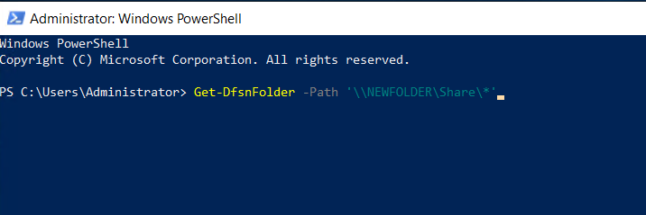

INTRODUCTION

[DFS](https://en.wikipedia.org/wiki/Distributed_File_System_(Microsoft)) is a set of client and server services that allow an organization using Microsoft Windows servers to organize many scattered SMB file shares into a distributed file system. DFS has two components to its service: Location transparency and Redundancy. Basically a distributed file system (DFS) is **a file system that spans across multiple file servers or multiple locations**, such as file servers that are situated in different physical places. Files are accessible just as if they were stored locally, from any device and from anywhere on the network. In this tutorial, we will learn how to set folders to DFS NameSpaces via PowerShell.

Prerequisites

- [Windows Server](https://utho.com/docs/tutorial/how-to-install-active-directory-domain-service-on-windows-server/?preview_id=11159&preview_nonce=171803715d&preview=true)

- PowerShell with Administrator rights

- Internet connectivity

Step 1. Login to your Windows Server

Step 2. Open PowerShell as an Administrator


**Step 3. Run the following command to set DFS folder path**

```
New-DfsnFolder -Path "\\NEWFOLDER\Share\Folder01" -TargetPath "\\NEWFOLDER\Share01"
```


**Step 4. Run the following command to set 2nd folder to DFS**

```
New-DfsnFolder -Path "\\NEWFOLDER\Share\Folder02" -TargetPath "\\NEWFOLDER\Share02"
```


**Step 5. Run the following command to check the changes set above** set folders to DFS

```
Get-DfsnFolder -Path '\\NEWFOLDER\Share\*'
```



Thank You.
