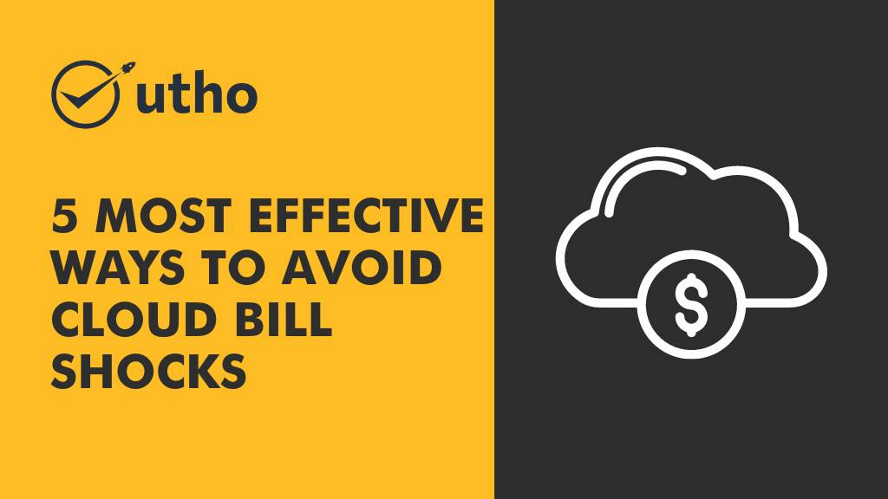

Cloud bill shock is a common phenomenon among IT managers, small and medium-sized businesses. **A cloud bill shock can arise when an unexpected, large bill arrives from your cloud service provider.** It can be an unpleasant surprise that erodes your budget and disrupts operations. But you don’t have to let these shocks derail your business. By following these **Five simple strategies,** you can avoid the majority of cloud bill shocks and optimize costs in the long run. 

<figure>

<figcaption>

Most Effective Ways to Avoid Cloud Bill Shocks.

</figcaption>

</figure>

##  **1. Establish a budget:**

The first step in avoiding **cloud bill shocks** is to establish a budget for your cloud services expenditures. Make sure that this budget is realistic, based on past usage and anticipated future needs. This will give you a clear understanding of what you’re willing to spend and help you plan accordingly throughout the year. 

## **2\. Monitor usage:**

Monitoring your usage of cloud services is key to avoiding costly surprises down the line. Investing in tools or services that provide real-time insights into resource utilization can help ensure that you never exceed your allocated budget—and save you money in the long run. 

## **3\. Use reserved instances:**

Reserved instances are pre-purchased contracts that guarantee capacity availability at fixed prices over a specified period of time—often one or three years—from the original purchase date. By taking advantage of such offerings, you can lower costs significantly by locking in discounted rates on commonly used services and resources over extended periods of time. 

## **4 .Optimize resources:**

Optimizing resources wisely can make a big difference when it comes to managing costs associated with cloud services utilization over time as well as minimizing unexpected bills from month to month..  For example, optimizing storage space by archiving data no longer being used but still needed for reference or compliance purposes could help reduce bills significantly over time .  Additionally, shutting down idle [virtual machines](https://en.wikipedia.org/wiki/Virtual_machine) during low usage times could also greatly reduce costs long term .    

## **5 Search for an alternative:** 

Switching cloud providers can be a daunting task for many business owners, but it can save them from the pain of high bill shocks. When selecting a new cloud provider, one of the most important criteria should be that your provider offers a predictable billing model. With such a model, you will have full control and visibility over your costs, allowing you to create budget plans and cost forecasts more accurately. Additionally, with predictable billing you will know exactly what to expect each month in terms of pricing and will be able to plan accordingly without being subject to sudden changes or unexpected surprises and [Microhost](https://utho.com/) is the right cloud provider for this.

With careful planning and effective management, it's possible to avoid most instances of cloud bill shock.
