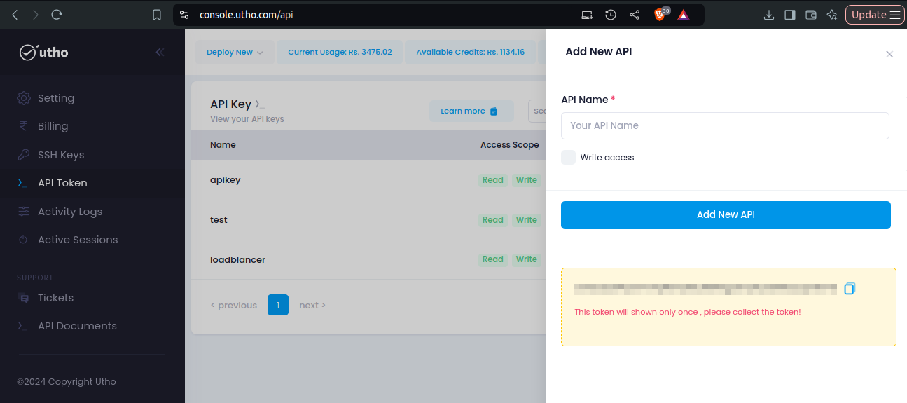
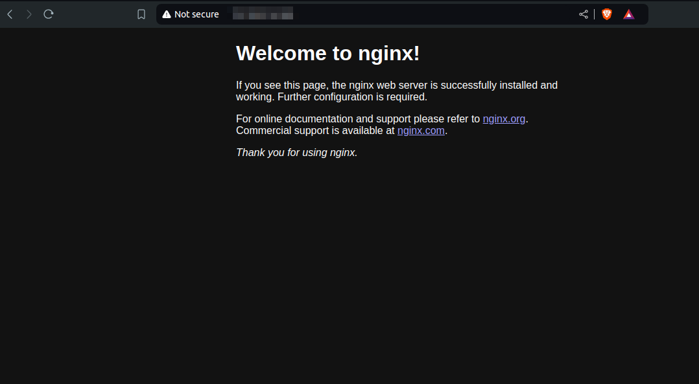

---

title: "Deployment Guide for Utho Cloud Load-Balancer Application Using Kubernetes and Helm"
date: "2024-11-15"
title_meta: "Utho Cloud Load-Balancer Deployment with Kubernetes and Helm"
description: "This guide provides a comprehensive step-by-step process to deploy a load-balancer application on Utho Cloud using Kubernetes and Helm, including configuration of the environment, installation of dependencies, and setup of a network load balancer."
keywords: ["Utho Cloud deployment", "Kubernetes Helm deployment", "Utho load balancer", "Kubernetes application setup"]
tags: ["Kubernetes", "Helm", "Utho Cloud", "Load Balancer"]
icon: "kubernetes"
lastmod: "2024-11-15T10:00:00+00:00"
draft: false
weight: 1
toc: true
tab: true

---

### **Deployment Guide for Utho Cloud Load-Balancer Application Using Kubernetes and Helm**

This document provides a step-by-step guide to configure and deploy an application on Utho Cloud using Kubernetes and Helm.

---

### **Prerequisites**
- Access to the **Utho Cloud UI**.
- Permissions to download the kubeconfig file.
- A target server with the **snap package manager** installed.

---

### **Deployment Steps**

#### **Step 1: Download the kubeconfig File**
1. Log in to the **Utho Cloud UI**.
2. Download the kubeconfig file to access your Kubernetes cluster.

---

#### **Step 2: Install `kubectl` on Your Target Server**
Install `kubectl` using the following command:

```bash
snap install kubectl --classic
```

---

#### **Step 3: Export the Kubeconfig File Path**
Set the kubeconfig file path to enable `kubectl` access to the cluster:

```bash
export KUBECONFIG=/root/kubeconfig
```

---

#### **Step 4: Install Helm**
Install Helm on the target server using:

```bash
snap install helm --classic
```

---

#### **Step 5: Add the Utho Operator Helm Repository**
Add the Utho Operator Helm repository to your Helm installation:

```bash
helm repo add utho-operator https://uthoplatforms.github.io/utho-app-operator-helm/
```

---

#### **Step 6: Update the Helm Repository**
Update the Helm repository to get the latest charts:

```bash
helm repo update
```

---

#### **Step 7: Create an API Key**
1. In the Utho Console, navigate to the **API Token** section.


2. Click **Create API Key**.
3. Configure the API:
   - Enter a name for the API.
   - Set the permission level to **Write**.
4. Click **Add new API** to generate the key.



5. Copy and save the API key for future use.

---

#### **Step 8: Install the Utho Application Using Helm**
Deploy the Utho application using the Helm chart:

```bash
helm install utho-operator utho-operator/utho-app-operator-chart --version 0.1.3 --set API_KEY=Your_api_key_here --set image.tag=0.1.4 -n default --create-namespace
```

Replace `Your_api_key_here` with the API key you created.

---


#### **Step 9: Deploy the NGINX Pod**
Create a `deployment.yaml` file with the following content:

```yaml
---
apiVersion: apps/v1
kind: Deployment
metadata:
  # Change name and label
  name: nginx
  namespace: default
  labels:
    app: nginx
spec:
  replicas: 1
  selector:
    matchLabels:
      # Change label
      app: nginx
  template:
    metadata:
      labels:
        # Change label
        app: nginx
    spec:
      containers:
        - name: nginx
          # Change container image
          image: nginx:latest
          ports:
            - containerPort: 80
```

Deploy the pod and create the necessary secret:

1. Apply the deployment:

   ```bash
   kubectl apply -f deployment.yaml
   ```

---

#### **Step 10: Expose the NodePort**
Create a `nodeport.yaml` file with the following content:

```yaml

apiVersion: v1
kind: Service
metadata:
  # Change name and namespace
  name: nginx
  namespace: default
spec:
  selector:
    app: nginx
  ports:
    - protocol: TCP
      # Internal port
      port: 8080
      # app exposed port
      targetPort: 80
      # Change exposed port
      # External port
      nodePort: 30088
  type: NodePort
```

Expose the service:

```bash
kubectl apply -f nodeport.yaml
```

---

#### **Step 11: Deploy the Network Load Balancer**
Create a `nlb.yaml` file with the following content:

```yaml
---
apiVersion: apps.utho.com/v1alpha1
kind: UthoApplication
metadata:
  # Chnage name
  name: nginx
  # Chnage namespace
  namespace: default
spec:
  loadBalancer:
    # Chnage name
    name: nginx
    dcslug: innoida
    # Chnage exposed extrnal port
    backendPort: 30088
    frontend:
      # Chnage name
      name: nginx
      algorithm: roundrobin
      protocol: tcp
      # loadBalancer port
      port: 80
    type: network
```

Update the `dcslug` value according to the desired data center location:
- **Noida**: `innoida`
- **Mumbai**: `inmumbaizone2`
- **Bangalore**: `inbangalore`
- **Frankfurt**: `defra1`
- **Los Angeles**: `uslosangeles`

Deploy the load balancer:

```bash
kubectl apply -f nlb.yaml
```

Logs for review
```
kubectl get pod -n default
Identify Name of Utho Operator Pod name

kubectl logs -f utho-app-operator-fd64fc8d5-tkc8l -c utho-app-operator

```
---

#### **Step 12: Check Deployment and Service Status**
Verify the status of the Utho application, pods, and services:

```bash
kubectl get UthoApplication -n default
kubectl get pod -n default
kubectl get svc -n default
```

---

#### **Step 13: Verify Application Functionality**
1. Check the URL and IP assigned in the Utho Cloud dashboard.
2. Access the service using the provided URL to confirm the application is running.


---

This concludes the deployment process for the Utho Cloud Load-Balancer Application.
